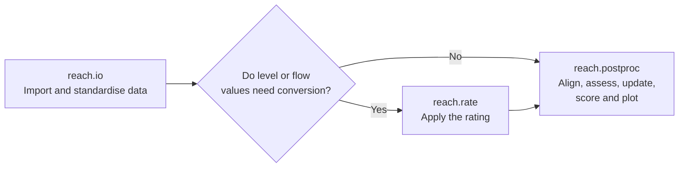
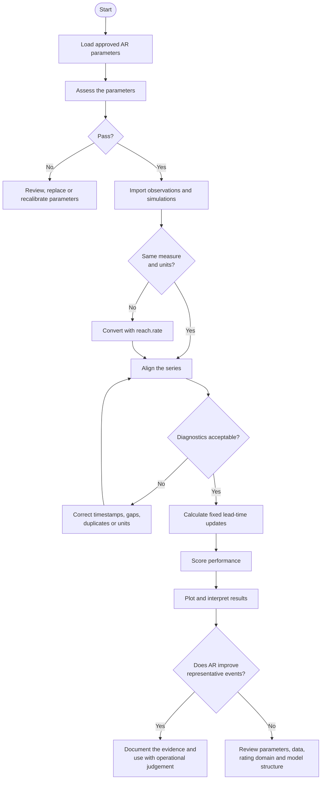

# reach.postproc

<!-- badges: start -->
<!-- Add continuous-integration and coverage badges here when the repository workflows exist. -->
<!-- badges: end -->

`reach.postproc` provides transparent autoregressive (AR) and autoregressive moving-average (ARMA) post-processing for flood forecasts. It supports parameter construction, characteristic-root analysis, Environment Agency parameter assessment, error projection, fixed lead-time evaluation, scoring and diagnostic plotting.

The package is designed for flood forecast modellers, analysts and developers. It keeps the operational workflow accessible while exposing the mathematics required for review and assurance.

## Scope

`reach.postproc` starts from prepared observed and simulated time series. It does not import operational data or apply rating curves.



The intended package boundaries are:

- **`reach.io`** imports and standardises observations and model data.
- **`reach.rate`** converts between level and flow where required.
- **`reach.postproc`** assesses AR parameters and evaluates forecast updates.

## Installation

Install the development version from GitHub:

```r
# install.packages("pak")
pak::pak("JonPayneEA/reach.postproc")
```

For local development:

```r
# install.packages("devtools")
devtools::install()
```

`DiagrammeR` is optional. Install it if you want Mermaid diagrams rendered as widgets when building the vignettes:

```r
install.packages("DiagrammeR")
```

## Quick start

### Assess an AR parameter set

The package includes the Environment Agency 2024 default parameters:

```r
library(reach.postproc)

parameters <- default_ar_parameters()

assessment <- assess(
  parameters
)

assessment@summary
assessment_table(
  assessment
)
```

Inspect the characteristic roots:

```r
root_information <- roots(
  parameters,
  time_step_minutes = 15
)

root_table(
  root_information
)

plot_ar(
  root_information,
  root_definition = "modal"
)
```

The default plot uses **modal roots**, matching the Environment Agency and Deltares formulation. Stable modal roots lie inside the unit circle.

A reciprocal lag-root view is also available:

```r
plot_ar(
  root_information,
  root_definition = "lag",
  maximum_plot_limit = 5
)
```

Stable reciprocal lag roots lie outside the unit circle.

### Forecast an error series

Initial errors are supplied newest first:

```r
error_forecast <- forecast_ar(
  parameters,
  initial_errors = c(
    0.15,
    0.12,
    0.10
  ),
  steps = 96L,
  time_step_minutes = 15
)

forecast_series(
  error_forecast
)

plot_ar(
  error_forecast
)
```

The package defines model error as:

```text
error = observation - simulation
```

A positive error means the simulation is too low. A negative error means it is too high.

## Event workflow

Prepare observed and simulated series with one row per timestamp:

```r
library(data.table)

observed <- data.table(
  date_time = seq(
    as.POSIXct(
      "2024-11-23 00:00:00",
      tz = "UTC"
    ),
    by = "15 min",
    length.out = 121L
  ),
  value = observed_values
)

simulated <- data.table(
  date_time = observed$date_time,
  value = simulated_values
)
```

Align the series and inspect the diagnostics:

```r
aligned <- align_forecast_series(
  observed = observed,
  simulated = simulated,
  interval_minutes = 15,
  timezone = "UTC",
  metadata = list(
    site_id = "example-site",
    event_id = "2024-11",
    measure = "level",
    units = "m"
  )
)

alignment_diagnostics(
  aligned
)

aligned_series(
  aligned
)
```

Calculate fixed lead-time updates:

```r
lead_results <- fixed_lead_ar(
  parameters = parameters,
  data = aligned,
  lead_times_minutes = c(
    30,
    60,
    90
  ),
  time_step_minutes = 15,
  lower_limit = 0
)
```

Score and plot the results:

```r
score_lead_times(
  lead_results
)

plot_lead_times(
  lead_results
)
```

## Recommended workflow



A parameter pass means the roots avoid the principal forms of unacceptable mathematical behaviour. It does not guarantee that every updated forecast will outperform the simulation.

## Sign conventions

`reach.postproc` accepts two coefficient conventions and stores parameters internally in the Deltares convention.

### Deltares convention

The recurrence is written as:

\[
x_t = a_1x_{t-1} + a_2x_{t-2} + \cdots + a_px_{t-p}
\]

The 2024 defaults are:

```r
ar_parameters(
  coefficients = c(
    a_1 = 1.765,
    a_2 = -0.72625,
    a_3 = -0.040656
  ),
  sign_convention = "Deltares"
)
```

### Standard signed-equation convention

The same dynamics may be supplied as:

```r
ar_parameters(
  coefficients = c(
    phi_1 = -1.765,
    phi_2 = 0.72625,
    phi_3 = 0.040656
  ),
  sign_convention = "Standard"
)
```

Do not infer the convention from coefficient names alone. Confirm the recurrence or characteristic polynomial used by the source system.

## Parameter assessment

The default assessment applies the criteria established for Environment Agency AR parameter review:

- only permitted AR orders pass;
- any growing root fails;
- any root with excessive decay time fails;
- a model where every root decays too quickly fails;
- unacceptable oscillation fails, except where the oscillating root disappears within the rapid-decay exception.

Use explicit arguments if the governing assessment standard differs:

```r
assessment <- assess(
  parameters,
  maximum_decay_time = 240,
  minimum_useful_decay_time = 8,
  rapid_decay_exception = 1,
  oscillation_ratio = -2 * log(0.1),
  decay_measure = "effective",
  permitted_orders = c(
    2L,
    3L
  ),
  time_step_minutes = 15
)
```

## Operational interpretation

AR post-processing predicts the future development of recent model error. It does not directly model river response.

Keep these limitations in view:

- AR cannot reliably correct future timing errors.
- Different recent error histories can produce different updates from the same parameter set.
- Observation noise and abrupt changes can be projected forwards.
- A lower limit changes the displayed update but not the underlying recurrence.
- Data gaps can disrupt the error history used for initialisation.
- Nonlinear ratings mean an additive update in flow will not retain the same shape after conversion to level.
- Updated upstream boundaries can transmit AR behaviour into downstream models.

## Main functions

### Parameter construction

- `ar_parameters()` constructs a parameter set.
- `default_ar_parameters()` returns the 2024 defaults.
- `convert_sign_convention()` converts supplied coefficient signs.
- `ar_parameters_from_timescales()` constructs parameters from root timescales.
- `roots_to_parameters()` converts modal roots to AR coefficients.

### Analysis and assessment

- `roots()` calculates modal and reciprocal lag roots.
- `assess()` applies the parameter-quality criteria.
- `decompose_ar()` separates the projected error into root contributions.
- `response()` calculates an ARMA unit response.
- `response_components()` compares AR and ARMA responses.

### Forecast evaluation

- `align_forecast_series()` aligns observed and simulated data.
- `fixed_lead_ar()` calculates fixed lead-time updates.
- `score_lead_times()` calculates forecast-performance metrics.
- `plot_lead_times()` plots observations, simulations and updates.

### Result accessors

- `root_table()` returns root diagnostics.
- `assessment_table()` returns assessment tests.
- `forecast_series()` returns an AR error forecast.
- `aligned_series()` returns aligned event data.
- `alignment_diagnostics()` returns alignment checks.
- `lead_time_series()` returns fixed lead-time results.

## Documentation

The package contains four vignettes:

- **ARMA for Novice Flood Forecast Modellers** provides a plain-English introduction and glossary.
- **AR and ARMA for Flood Forecasting** explains the operational theory and IMFS context.
- **Using reach.postproc** provides a practical package workflow.
- **Mathematical and Developer Validation** explains numerical equivalence tests and indexing conventions.

Build and open the vignettes with:

```r
devtools::build_vignettes()

browseVignettes(
  "reach.postproc"
)
```

## Development

Run the complete local validation sequence with:

```r
devtools::document()
devtools::load_all()
devtools::test()
devtools::build_vignettes()
devtools::check()
```

The mathematical test suite should verify at least:

- parameter-to-root-to-parameter round trips;
- recurrence and modal-decomposition equivalence;
- stable and unstable root classification;
- fixed lead-time calculation;
- unit-circle geometry.

## Contributing

Contributions should include:

- a clear description of the forecasting or mathematical problem;
- tests covering the change and relevant edge cases;
- updated function documentation;
- updated vignettes where user behaviour changes;
- no new hidden file output or modification of caller-owned tables by reference.

## Licence

This project is released under the MIT licence. See `LICENSE` for details.
