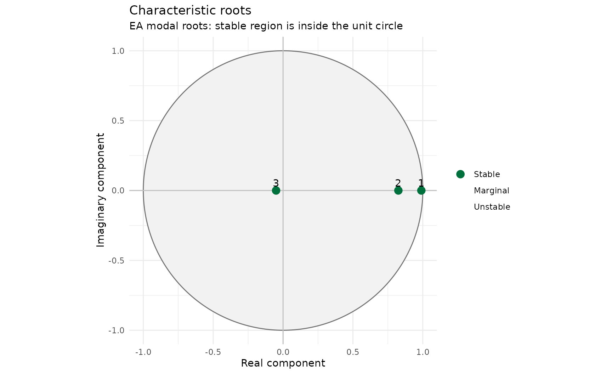
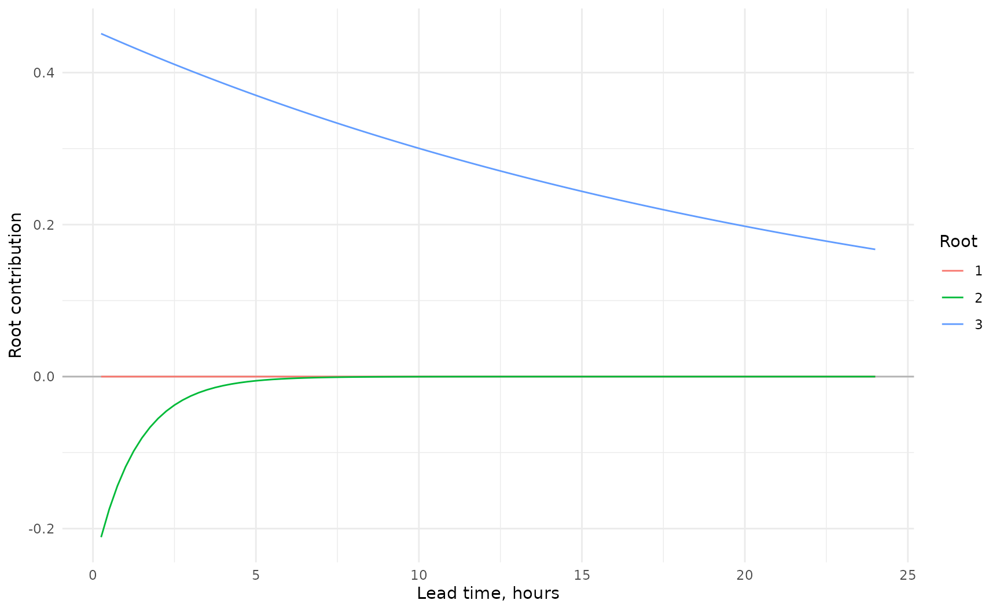
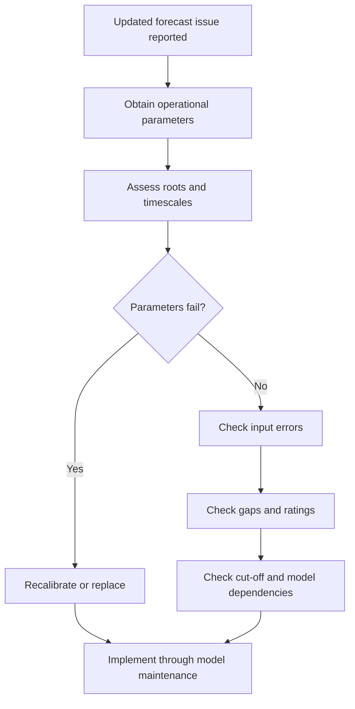

# AR and ARMA for Flood Forecasting

## Purpose

This vignette explains the base AR and ARMA methods used to post-process
flood forecasts in IMFS. It follows the methodology supplied in *ARMA
for flood forecasting, Part 1: Base ARMA in IMFS* and connects that
methodology to `reach.postproc`.

It is intended for flood forecast modellers, analysts and Digital
Services staff who need more than awareness. It explains the range of
behaviours an AR model can produce, how those behaviours arise and how
parameters should be assessed.

## ARMA in flood forecasting

Let $`y_{obs,t}`$ be an observation and $`y_{sim,t}`$ the simulated
forecast value. The model error is

``` math
x_t=y_{obs,t}-y_{sim,t}.
```

At the forecast origin, past errors are known where observations exist.
Future errors are unknown. The update projects those future errors and
adds them to the simulation:

``` math
y_{upd,t}=y_{sim,t}+\hat{x}_t.
```

The AR series can therefore be understood separately from the simulated
hydrograph.

## Current IMFS implementation

Delft-FEWS supports a full ARMA form. Current Environment Agency
operational models use second- or third-order AR terms and no MA terms.

The common third-order recurrence is

``` math
x_t=a_1x_{t-1}+a_2x_{t-2}+a_3x_{t-3}
=\sum_{n=1}^{3}a_nx_{t-n}.
```

Once $`x_t`$ is known, the relation advances one timestep at a time.
Three ordered historic errors are sufficient to project the whole future
error series.

## Sign conventions

Two sign conventions are common.

| Feature | Deltares convention | Standard signed equation |
|:---|:---|:---|
| Model form | $`x_t=\sum a_nx_{t-n}`$ | $`x_t+\sum\phi_nx_{t-n}=\varepsilon_t`$ |
| Relationship | $`a_n`$ | $`\phi_n=-a_n`$ |
| 2024 defaults | $`(1.765,-0.72625,-0.040656)`$ | $`(-1.765,0.72625,0.040656)`$ |
| Internal package form | retained | converted once to Deltares |

``` r

deltares <- ar_parameters(
  coefficients = c(1.765, -0.72625, -0.040656),
  sign_convention = "Deltares"
)

standard <- ar_parameters(
  coefficients = c(-1.765, 0.72625, 0.040656),
  sign_convention = "Standard"
)

all.equal(
  deltares@coefficients,
  standard@coefficients
)
#> [1] TRUE
```

The word *standard* is not universal across software. Verify the
equation rather than relying on coefficient names.

## First-order behaviour

For AR(1),

``` math
x_t=a_1x_{t-1}.
```

- $`0<a_1<1`$ gives exponential decay.
- $`a_1=1`$ gives persistence.
- $`a_1>1`$ gives exponential growth.
- $`a_1<0`$ changes sign every timestep.

The magnitude controls growth or decay. The sign controls alternation.

## Characteristic roots

A higher-order recurrence can be rewritten as

``` math
x_t=\sum_{n=1}^{p}c_nz_n^t,
```

where $`z_n`$ solve

``` math
z^p-\sum_{n=1}^{p}a_nz^{p-n}=0.
```

The roots are fixed by the parameter set. The root weights $`c_n`$ are
determined by the recent error history.

``` r

parameters <- default_ar_parameters()
root_information <- roots(parameters, time_step_minutes = 15)
root_table(root_information)
#>    root_id   root_real root_imaginary root_modulus lag_root_real
#>      <int>       <num>          <num>        <num>         <num>
#> 1:       3  0.98961490   1.100114e-24   0.98961490      1.010494
#> 2:       2  0.82517187  -1.306909e-24   0.82517187      1.211869
#> 3:       1 -0.04978678   2.067952e-25   0.04978678    -20.085655
#>    lag_root_imaginary lag_root_modulus raw_decay_time_steps decay_time_steps
#>                 <num>            <num>                <num>            <num>
#> 1:      -1.123324e-24         1.010494           95.7909755       95.7909755
#> 2:       1.919360e-24         1.211869            5.2038996        5.2038996
#> 3:      -8.342810e-23        20.085655            0.3333327        0.3333327
#>    effective_decay_time_steps decay_time_hours effective_decay_time_hours
#>                         <num>            <num>                      <num>
#> 1:                 95.7909755      23.94774387                 23.9477439
#> 2:                  5.2038996       1.30097489                  1.3009749
#> 3:                  0.2338708       0.08333317                  0.0584677
#>    oscillation_period_steps oscillation_period_hours is_growing is_persistent
#>                       <num>                    <num>     <lgcl>        <lgcl>
#> 1:                      Inf                      Inf      FALSE         FALSE
#> 2:                      Inf                      Inf      FALSE         FALSE
#> 3:                        2                      0.5      FALSE         FALSE
#>    is_oscillating modal_stability lag_stability display_order
#>            <lgcl>          <fctr>        <fctr>         <int>
#> 1:          FALSE          Stable        Stable             1
#> 2:          FALSE          Stable        Stable             2
#> 3:           TRUE          Stable        Stable             3
plot_ar(root_information, root_definition = "modal")
```



## Decay and oscillation

A root can be expressed as

``` math
z=\exp\left(-\frac{1}{\tau}\right)
\exp\left(\frac{2\pi i}{T}\right),
```

with

``` math
\tau=-\frac{1}{\ln|z|},
\qquad
T=\frac{2\pi}{|\arg(z)|}.
```

Positive real roots do not oscillate. Negative real roots have period
two. Complex roots occur in conjugate pairs.

For modal roots:

- $`|z|<1`$ means decay;
- $`|z|=1`$ means persistence;
- $`|z|>1`$ means growth.

Reciprocal lag roots are $`B_n=1/z_n`$ and reverse the inside/outside
stability region.

## Dependence on the input error series

The roots define possible behaviours. The weights determine how strongly
those behaviours appear in a particular forecast.

Steady recent errors often give smooth projections. Sharp changes can
require large weights, expose normally minor roots and amplify
oscillation. A parameter set should never be judged from one forecast
run.

``` r

components <- decompose_ar(
  parameters,
  initial_errors = c(0.20, 0.15, 0.10),
  steps = 96L,
  time_step_minutes = 15
)

ggplot(
  components,
  aes(
    x = lead_time_hours,
    y = contribution_real,
    colour = factor(root_number)
  )
) +
  geom_hline(yintercept = 0, colour = "grey70") +
  geom_line() +
  theme_minimal() +
  labs(x = "Lead time, hours", y = "Root contribution", colour = "Root")
```



## Timing errors

AR is aware of timing error only when that difference is already encoded
in the input errors. It cannot anticipate a future shift in the
simulated hydrograph.

Where observation has started rising but simulation has not, the update
may initially move towards the observation. It does not reliably correct
the timing of the later peak.

## Zero cut-off in IMFS

A negative projected error can exceed the simulated value and produce a
negative unconstrained update. IMFS may impose

``` math
y_{upd,t}=\max(0,y_{sim,t}+\hat{x}_t).
```

The AR series continues to be calculated without that bound. A flat line
at zero is not by itself evidence of poor parameters.

## Data gaps

Delft-FEWS treats a missing-observation section as another forecast
segment. Where too few observed values occur between gaps, previously
projected values may contribute to the next initial state. Repeated
transitions can create erratic behaviour.

Gaps can arise from:

- telemetry;
- missing simulation data;
- interpolation settings;
- rating curves that are undefined over part of the data range.

Diagnose the source before modifying parameters.

## Rated updated series

AR is additive in the domain where it is applied. For nonlinear rating
$`f`$,

``` math
f(h+x)\ne f(h)+f(x).
```

A smooth flow update can therefore look unusual after conversion to
level, or vice versa. Compare both domains and confirm where thresholds
are defined.

## Effects on downstream models

Many updated upstream series become boundaries to downstream hydraulic
models. Any growth, oscillation, cut-off artefact or rating distortion
can propagate.

Dry-weather decay can also introduce a small artificial rise or fall
into a downstream model. The priority remains event behaviour, but
model-network consequences should be considered.

## Fixed lead-time plots

A fixed lead-time line contains the value that would have been forecast
had AR been started a constant number of timesteps earlier.

For a 60-minute lead at a 15-minute timestep:

1.  move four steps back from the target;
2.  read the error history available at that origin;
3.  project AR forward four steps;
4.  add the projected error to the simulation at the target.

These series underpin performance testing and calibration. They differ
from one operational forecast started at a single time.

## Parameter assessment

The 2024 project established these tests.

### Growth

Fail if any modal root grows:

``` math
|z|>1,
```

or equivalently $`\tau<0`$.

### Excessive persistence

Fail if any root has

``` math
\tau\ge240
```

timesteps. At 15 minutes this is 2.5 days.

### Universally rapid decay

Fail if every root has

``` math
\tau<8.
```

Fast secondary roots are acceptable if another root remains useful.

### Oscillation

Fail an oscillating root where

``` math
T<4.605\tau.
```

Ignore this test where $`\tau<1`$ because the oscillation disappears
rapidly.

``` r

assessment <- assess(
  parameters,
  maximum_decay_time = 240,
  minimum_useful_decay_time = 8,
  rapid_decay_exception = 1,
  oscillation_ratio = -2 * log(0.1),
  decay_measure = "effective",
  permitted_orders = c(2L, 3L),
  time_step_minutes = 15
)

assessment@summary
#> [1] "Pass. All roots meet the accepted criteria."
assessment_table(assessment)
#>    test_id                        test failed affected_roots
#>     <char>                      <char> <lgcl>         <list>
#> 1:   order          Permitted AR order  FALSE               
#> 2:       a          Exponential growth  FALSE               
#> 3:       b        Excessive decay time  FALSE               
#> 4:       c All roots decay too quickly  FALSE               
#> 5:       d    Unacceptable oscillation  FALSE               
#>               criterion
#>                  <char>
#> 1:      permitted order
#> 2:      no growing root
#> 3:        maximum decay
#> 4: minimum useful decay
#> 5:    oscillation ratio
```

## Effective decay time

Oscillation can make initial decay faster than the exponential envelope.
Effective decay time solves

``` math
\exp\left(-\frac{\tau_{eff}}{\tau}\right)
\cos\left(\frac{2\pi\tau_{eff}}{T}\right)=e^{-1}.
```

State whether an assessment uses exponential or effective decay.

## The 2024 default parameters

The defaults are

``` math
a_1=1.765,\qquad a_2=-0.72625,\qquad a_3=-0.040656.
```

Their roots provide:

- one contribution on the scale of about one day;
- one contribution on the scale of hours;
- one rapidly decaying negative contribution that handles sharp
  short-term changes.

Retain at least the stated precision. Small coefficient changes can
produce large changes in the longest decay time.

## Calibration

### IMFS Performance Testing

Automated optimisation does not protect against unacceptable roots.
Parameters generated by an automatic method must be assessed
independently.

### PDM for PCs

PDM for PCs can fit higher-order full ARMA models. Calibration should
focus on flood events rather than long records dominated by dry
conditions. Avoid truncating coefficients so strongly that root
timescales change materially.

### Flood Modeller

Flood Modeller’s Gauge Updating Unit is conceptually similar but
mathematically distinct. Do not assume its parameters map directly to
IMFS AR coefficients.

### Manual construction

Root timescales are more interpretable than raw coefficients.

``` r

constructed <- ar_parameters_from_timescales(
  decay_times = c(96, 5.203171, 1 / 3),
  oscillation_periods = c(Inf, Inf, 2),
  label = "One-day principal decay"
)

constructed@coefficients
#>         a_1         a_2         a_3 
#>  1.76500000 -0.72624604 -0.04065607
root_table(roots(constructed))
#>    root_id   root_real root_imaginary root_modulus lag_root_real
#>      <int>       <num>          <num>        <num>         <num>
#> 1:       3  0.98963740  -2.019484e-28   0.98963740      1.010471
#> 2:       2  0.82514967   2.019484e-28   0.82514967      1.211901
#> 3:       1 -0.04978707   0.000000e+00   0.04978707    -20.085537
#>    lag_root_imaginary lag_root_modulus raw_decay_time_steps decay_time_steps
#>                 <num>            <num>                <num>            <num>
#> 1:       2.061998e-28         1.010471           96.0000000       96.0000000
#> 2:      -2.966026e-28         1.211901            5.2031710        5.2031710
#> 3:       0.000000e+00        20.085537            0.3333333        0.3333333
#>    effective_decay_time_steps decay_time_hours effective_decay_time_hours
#>                         <num>            <num>                      <num>
#> 1:                 96.0000000      24.00000000                24.00000000
#> 2:                  5.2031710       1.30079275                 1.30079275
#> 3:                  0.2338711       0.08333333                 0.05846776
#>    oscillation_period_steps oscillation_period_hours is_growing is_persistent
#>                       <num>                    <num>     <lgcl>        <lgcl>
#> 1:                      Inf                      Inf      FALSE         FALSE
#> 2:                      Inf                      Inf      FALSE         FALSE
#> 3:                        2                      0.5      FALSE         FALSE
#>    is_oscillating modal_stability lag_stability display_order
#>            <lgcl>          <fctr>        <fctr>         <int>
#> 1:          FALSE          Stable        Stable             1
#> 2:          FALSE          Stable        Stable             2
#> 3:           TRUE          Stable        Stable             3
```

The longest timescale should broadly reflect catchment response while
remaining suitable for flood events and the forecast horizon.

## Maintenance workflow



## Full ARMA equation

A full ARMA$`(p,q)`$ model is

``` math
x_t=\sum_{n=1}^{p}a_nx_{t-n}
+\varepsilon_t
+\sum_{m=1}^{q}b_m\varepsilon_{t-m}.
```

The AR terms retain memory of previous errors. The MA terms represent
the response to new residual innovations.

## Response functions

The unit AR response is

``` math
G_t^{AR}=\sum_{n=1}^{p}g_n^{AR}z_n^t.
```

The full ARMA response is the convolution

``` math
G^{ARMA}=G^{MA}*G^{AR}.
```

``` r

response_data <- response_components(
  parameters,
  ma_parameters = c(-0.5, -0.25, -0.125),
  steps = 100L
)

ggplot(response_data, aes(step, response, colour = component)) +
  geom_hline(yintercept = 0, colour = "grey70") +
  geom_line() +
  theme_minimal()
```


## Limitations and future development

Base AR models have fixed timescales. They cannot adapt between wet and
dry conditions, anticipate future structure operation or remove
observation noise. Their output depends on both forecast origin and
recent error history.

These limitations define where judgement remains necessary. They also
motivate event-triggered and alternative updating approaches.

## Summary

- Model the error, not the river response.
- Preserve the error-sign convention.
- Interpret parameters through roots and timescales.
- Reject growth.
- Assess oscillation in relation to decay.
- Examine multiple input-error histories.
- Diagnose gaps, ratings and cut-offs separately.
- Evaluate performance at fixed lead times.
- Retain sufficient coefficient precision.
