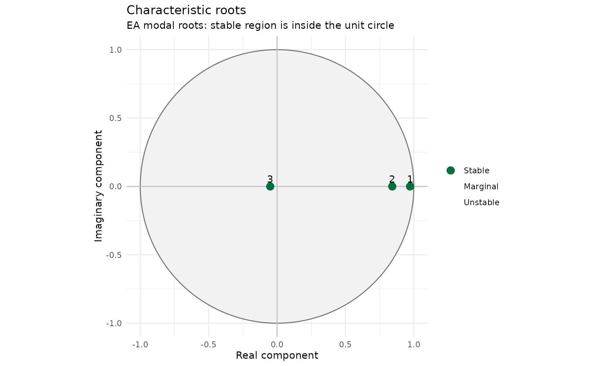
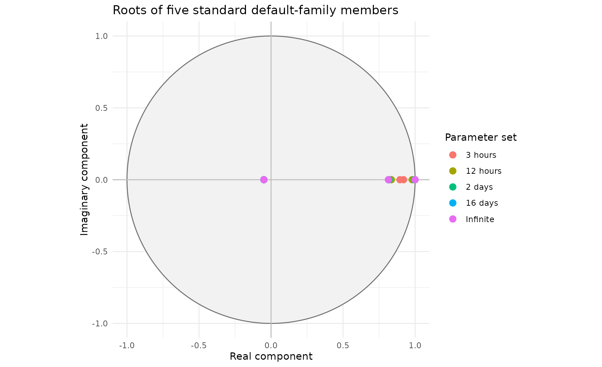

# Selecting a Default-Family Parameter Set

## Selecting a default-family parameter set

A new AR model does not require three independently estimated decay
times. In the default family, the principal root controls most
long-duration behaviour. The middle and rapid roots shape the response
shortly after the forecast starts. It is therefore sufficient to select
one principal timescale for the catchment.

Suitable evidence includes catchment response time, FEH lag, event
analysis and a broad rapid, medium or slow response classification. The
five-day IMFS forecast horizon and the inability of fixed-parameter AR
to represent different dry- and wet-period timescales mean that the
selected value should be treated as a useful catchment classification,
not a precisely calibrated physical constant.

### Continuous analytical construction

``` r

parameters <- default_family_ar_parameters(
  principal_decay = 9,
  units = "hours",
  time_step_minutes = 15
)

parameters@coefficients
#>         a_1         a_2         a_3 
#>  1.76500000 -0.72875763 -0.04078111
root_table(roots(parameters, time_step_minutes = 15))
#>    root_id   root_real root_imaginary root_modulus lag_root_real
#>      <int>       <num>          <num>        <num>         <num>
#> 1:       3  0.97260448   9.047288e-26   0.97260448      1.028167
#> 2:       2  0.84218259  -9.047288e-26   0.84218259      1.187391
#> 3:       1 -0.04978707   0.000000e+00   0.04978707    -20.085537
#>    lag_root_imaginary lag_root_modulus raw_decay_time_steps decay_time_steps
#>                 <num>            <num>                <num>            <num>
#> 1:      -9.564139e-26         1.028167           36.0000000       36.0000000
#> 2:       1.275575e-25         1.187391            5.8221304        5.8221304
#> 3:       0.000000e+00        20.085537            0.3333333        0.3333333
#>    effective_decay_time_steps decay_time_hours effective_decay_time_hours
#>                         <num>            <num>                      <num>
#> 1:                 36.0000000       9.00000000                 9.00000000
#> 2:                  5.8221304       1.45553260                 1.45553260
#> 3:                  0.2338711       0.08333333                 0.05846776
#>    oscillation_period_steps oscillation_period_hours is_growing is_persistent
#>                       <num>                    <num>     <lgcl>        <lgcl>
#> 1:                      Inf                      Inf      FALSE         FALSE
#> 2:                      Inf                      Inf      FALSE         FALSE
#> 3:                        2                      0.5      FALSE         FALSE
#>    is_oscillating modal_stability lag_stability display_order
#>            <lgcl>          <fctr>        <fctr>         <int>
#> 1:          FALSE          Stable        Stable             1
#> 2:          FALSE          Stable        Stable             2
#> 3:           TRUE          Stable        Stable             3
plot_ar(roots(parameters, time_step_minutes = 15), root_definition = "modal")
```



This calculation does not interpolate between the six-hour and
twelve-hour rows of a table. It sets the nine-hour principal root
directly, solves the middle root while retaining the default-family
constraints and converts the three roots to AR coefficients. All three
roots sit inside the unit circle, as the family’s own construction
guarantees: the validity check in `default_family_ar_parameters()`
refuses to return a member whose middle root would not.

### Standard published choices

Use a named standard set where configuration consistency and easy
recognition are priorities.

``` r

parameters <- standard_family_ar_parameters("12 hours")
parameters@coefficients
#>         a_1         a_2         a_3 
#>  1.76500000 -0.72782773 -0.04073482
```

The full catalogue is available programmatically:

``` r

standard_family_ar_table()
#>     parameter_set principal_decay_steps principal_decay_hours   a_1        a_2
#>            <char>                 <num>                 <num> <num>      <num>
#>  1:       3 hours                    12                     3 1.765 -0.7328501
#>  2:       6 hours                    24                     6 1.765 -0.7303273
#>  3:      12 hours                    48                    12 1.765 -0.7278277
#>  4:         1 day                    96                    24 1.765 -0.7262460
#>  5:        2 days                   192                    48 1.765 -0.7253693
#>  6:        4 days                   384                    96 1.765 -0.7249091
#>  7:        8 days                   768                   192 1.765 -0.7246735
#>  8:       16 days                  1536                   384 1.765 -0.7245543
#>  9:       32 days                  3072                   768 1.765 -0.7244943
#> 10:       64 days                  6144                  1536 1.765 -0.7244643
#> 11:      Infinite                   Inf                   Inf 1.765 -0.7244341
#>             a_3 fast_decay_steps fast_period_steps middle_decay_steps
#>           <num>            <num>             <num>              <num>
#>  1: -0.04098486        0.3333333                 2           8.991258
#>  2: -0.04085926        0.3333333                 2           6.412102
#>  3: -0.04073482        0.3333333                 2           5.560536
#>  4: -0.04065607        0.3333333                 2           5.203171
#>  5: -0.04061242        0.3333333                 2           5.038467
#>  6: -0.04058951        0.3333333                 2           4.959295
#>  7: -0.04057777        0.3333333                 2           4.920468
#>  8: -0.04057184        0.3333333                 2           4.901240
#>  9: -0.04056886        0.3333333                 2           4.891672
#> 10: -0.04056736        0.3333333                 2           4.886899
#> 11: -0.04056586        0.3333333                 2           4.882134
```

The table is useful for governance, recognition and validation. It is
not required for calculation and should not be used for linear
interpolation of coefficients.

### Precision

Small changes in the second and third coefficients can produce large
changes in principal decay time. Keep full numerical precision within R.
Where values must be transferred manually, retain at least five
significant figures and reassess the resulting roots after transfer.

### Mathematical construction

The standard table contains selected points from a continuous analytical
family. The coefficients are not obtained by interpolating between
adjacent rows.

For a principal decay time $`\tau_1`$, expressed in model timesteps, the
principal modal root is

``` math
z_1 = \exp\left(-\frac{1}{\tau_1}\right).
```

For an infinite principal decay time,

``` math
z_1 = 1.
```

The rapid root is defined by a decay time $`\tau_3`$ and oscillation
period $`T_3`$:

``` math
z_3 = \exp\left(-\frac{1}{\tau_3}\right)
      \exp\left(\frac{2\pi i}{T_3}\right).
```

The default family uses

``` math
\tau_3 = \frac{1}{3},
\qquad
T_3 = 2.
```

Because $`\exp(\pi i)=-1`$, the rapid root is a negative real root:

``` math
z_3 = -\exp(-3) \approx -0.04978707.
```

For a third-order model, the first AR coefficient is the sum of the
three roots:

``` math
a_1 = z_1 + z_2 + z_3.
```

The default family fixes

``` math
a_1 = 1.765.
```

The middle positive root is therefore solved directly:

``` math
z_2 = 1.765 - z_1 - z_3.
```

Its decay time is

``` math
\tau_2 = -\frac{1}{\ln(z_2)}.
```

Once the three modal roots are known, the characteristic polynomial is

``` math
(z-z_1)(z-z_2)(z-z_3)
=
z^3-a_1z^2-a_2z-a_3.
```

Expanding the product gives the Deltares AR coefficients:

``` math
a_1 = z_1+z_2+z_3,
```

``` math
a_2 = -(z_1z_2+z_1z_3+z_2z_3),
```

and

``` math
a_3 = z_1z_2z_3.
```

This is the calculation performed by `default_family_ar_parameters()`.
The only empirical decision is the choice of principal decay time. The
conversion from that timescale to roots and coefficients is
deterministic.

#### Worked nine-hour example

For a 15-minute model timestep, a nine-hour principal decay corresponds
to

``` math
\tau_1 = \frac{9\times60}{15}=36
```

timesteps. The principal root is therefore

``` math
z_1 = \exp\left(-\frac{1}{36}\right).
```

The package then calculates $`z_2`$, retains the fixed rapid root
$`z_3`$, and converts the three roots to coefficients.

``` r

nine_hour <- default_family_ar_parameters(
  principal_decay = 9,
  units = "hours",
  time_step_minutes = 15
)

attr(nine_hour, "modal_roots")
#>   principal      middle        fast 
#>  0.97260448  0.84218259 -0.04978707
attr(nine_hour, "middle_decay_steps")
#> [1] 5.82213
nine_hour@coefficients
#>         a_1         a_2         a_3 
#>  1.76500000 -0.72875763 -0.04078111
```

#### Why the coefficients change so little

The root modulus is related exponentially to decay time:

``` math
|z|=\exp\left(-\frac{1}{\tau}\right).
```

As $`\tau`$ becomes large, $`|z|`$ approaches one. Large changes in a
long decay time therefore correspond to small changes in the principal
root and still smaller changes in the resulting coefficients. This
explains why parameter sets with markedly different principal decay
times can have visually similar values of $`a_2`$ and $`a_3`$.

It also explains why coefficient rounding matters. A small numerical
change in a coefficient can imply a much larger change in the longest
decay time. Calculate and store coefficients at full precision; round
only for display.

#### Visualising the family

[`plot_ar()`](https://jonpayneea.github.io/reach.postproc/reference/plot_ar.md)
shows one parameter set’s roots at a time. To see the claim above
directly, rather than take it on trust, plot the principal root from
several published standard sets together:

``` r

family_roots <- data.table::rbindlist(lapply(
  c("3 hours", "12 hours", "2 days", "16 days", "Infinite"),
  function(choice) {
    d <- root_table(roots(standard_family_ar_parameters(choice)))
    d[, parameter_set := choice]
    d
  }
))

# Same unit-circle construction plot_ar() uses internally, for a consistent
# visual style between this custom plot and the package's own plots.
angle <- seq(0, 2 * pi, length.out = 721L)
unit_circle <- data.table::data.table(x = cos(angle), y = sin(angle))

ggplot() +
  geom_polygon(
    data = unit_circle, aes(x, y, group = 1),
    fill = "grey95", colour = "grey45"
  ) +
  geom_hline(yintercept = 0, colour = "grey75") +
  geom_vline(xintercept = 0, colour = "grey75") +
  geom_point(
    data = family_roots,
    aes(
      root_real, root_imaginary,
      colour = factor(parameter_set, levels = c(
        "3 hours", "12 hours", "2 days", "16 days", "Infinite"
      ))
    ),
    size = 3
  ) +
  coord_fixed() +
  theme_minimal() +
  labs(
    x = "Real component", y = "Imaginary component", colour = "Parameter set",
    title = "Roots of five standard default-family members"
  )
```



Three clusters are visible. The fast root sits at the same point for
every parameter set (it is fixed by construction, at `-0.0498`). The
middle root moves only a little across the whole published range. The
principal root is the one doing most of the work: it starts noticeably
inside the circle at “3 hours” and crowds closer and closer to `1` as
the principal decay lengthens, exactly as the exponential relationship
above predicts, and visibly slowing down as it does so – the gap between
“16 days” and “Infinite” is far smaller than the gap between “3 hours”
and “12 hours”, even though the second pair differs by far more decay
time. That compression is the whole reason coefficient rounding has to
be handled with care at the long-decay end of the family.
