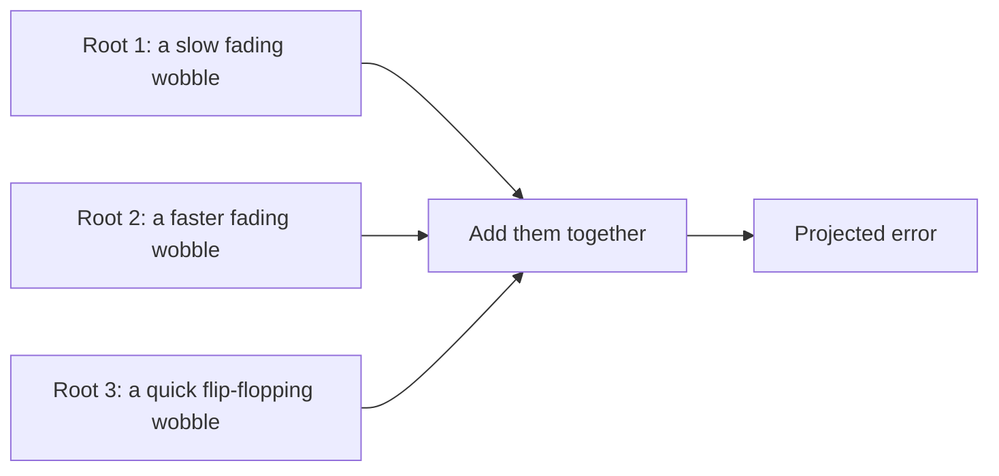
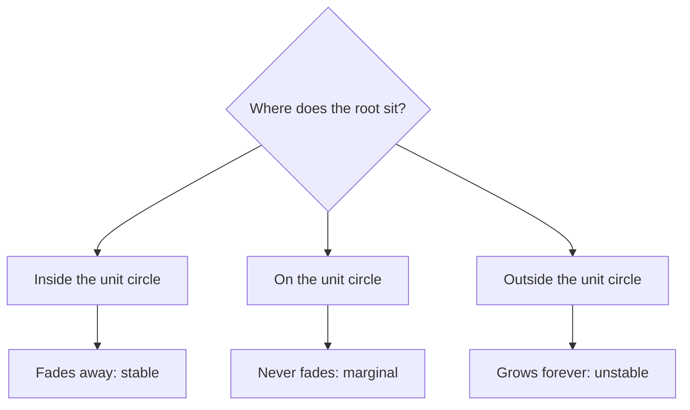
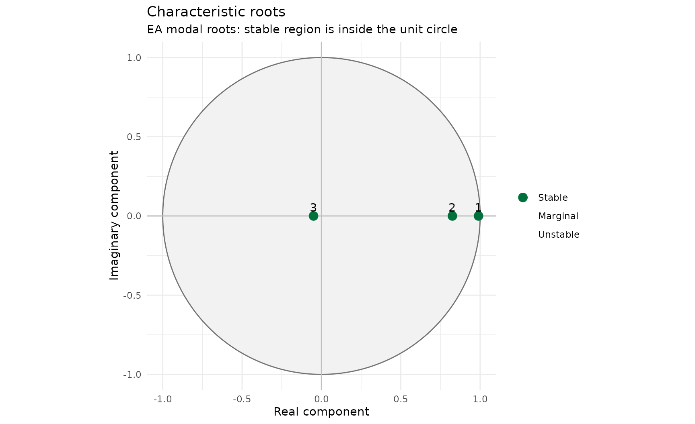
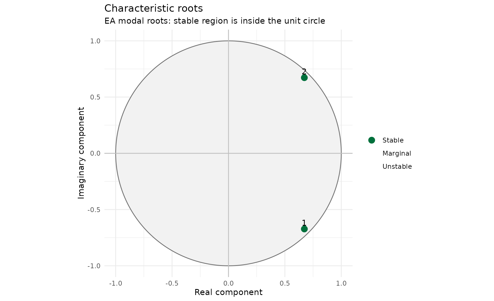
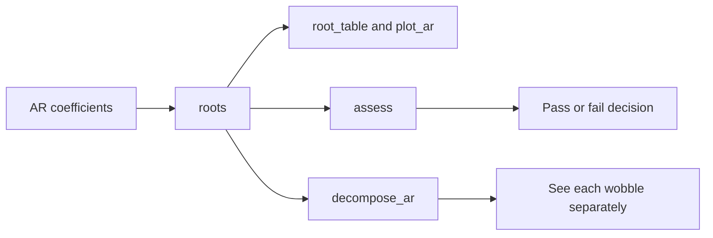

# Characteristic Roots for Novice Flood Forecast Modellers

## Purpose

[“ARMA for Novice Flood Forecast
Modellers”](https://jonpayneea.github.io/reach.postproc/articles/arma-for-novices.md)
explains what AR does and why. This vignette is the deep dive on one
part of that picture: characteristic roots, what they are, how
`reach.postproc` uses them, and what they mean for whether a parameter
set is safe to run operationally. No background in time-series
mathematics is assumed.

## What a root actually is

The error between an observation and a model’s simulation rarely moves
in one simple way. It can fade quietly, linger stubbornly, or flip
between positive and negative a few times before settling down. A root
describes **one** of those behaviours in isolation.

Think of it like this: the projected error isn’t one wobble, it’s
several wobbles happening at once, added together. A third-order (AR(3))
model has three roots, so three wobbles. One might be a slow, gentle
fade. Another might fade twice as fast. A third might flip sign at every
timestep while shrinking rapidly. Add all three together and you get the
projected error the package actually reports.



You never have to work out the wobbles yourself.
[`roots()`](https://jonpayneea.github.io/reach.postproc/reference/roots.md)
does that for you, starting from the AR coefficients you supply. What
matters is being able to read what comes back, because that’s what tells
you whether a parameter set will behave sensibly before you ever run it
against real data.

## Reading one root

A root is a single point on a two-dimensional map: it has a **real**
part and (sometimes) an **imaginary** part. Where that point sits tells
you everything about how its wobble behaves.

The reference point is the **unit circle** — an imaginary circle of
radius one drawn around zero. `reach.postproc` always plots this circle
alongside the roots, because where a point falls relative to it is the
whole story:



A root’s distance from zero is called its **modulus**. Modulus less than
one means stable (the wobble fades). Modulus exactly one means marginal
(it never fades, it never grows, it just sits there forever). Modulus
greater than one means unstable (the wobble grows, which is never
acceptable in an operational parameter set).

Try it on the Environment Agency’s own defaults:

``` r

parameters <- default_ar_parameters()
root_information <- roots(parameters)

root_table(root_information)[, .(root_id, root_real, root_imaginary, root_modulus, modal_stability)]
#>    root_id   root_real root_imaginary root_modulus modal_stability
#>      <int>       <num>          <num>        <num>          <fctr>
#> 1:       3  0.98961490   1.100114e-24   0.98961490          Stable
#> 2:       2  0.82517187  -1.306909e-24   0.82517187          Stable
#> 3:       1 -0.04978678   2.067952e-25   0.04978678          Stable
plot_ar(root_information, root_definition = "modal")
```



All three points sit inside the circle, and the `modal_stability` column
confirms it: `Stable`. That’s a basic precondition for a usable
parameter set, though not the only one — more on that below.

## Decay time

Knowing a root is stable tells you *that* it fades. Decay time tells you
*how fast*. It’s the number of timesteps it takes for a non-oscillating
wobble to fall to about a third of its starting size (37%, to be precise
— the same “about a third” rule that governs anything decaying
exponentially).

``` r

root_table(root_information)[, .(root_id, decay_time_steps, decay_time_hours)]
#>    root_id decay_time_steps decay_time_hours
#>      <int>            <num>            <num>
#> 1:       3       95.7909755      23.94774387
#> 2:       2        5.2038996       1.30097489
#> 3:       1        0.3333327       0.08333317
```

A root with a decay time of 2 steps has essentially vanished within a
handful of timesteps: useful for reacting to a sudden change, useless
for remembering anything beyond the immediate present. A root with a
decay time of 200 steps barely moves across an entire forecast: useful
for representing a slowly-drifting bias, dangerous if it’s slow enough
to keep an old, now-irrelevant error alive for days. `reach.postproc`’s
[`assess()`](https://jonpayneea.github.io/reach.postproc/reference/assess.md)
checks both ends of that range, which the next section covers.

## Oscillation and complex roots

Some wobbles don’t just shrink smoothly, they swing between positive and
negative while they shrink — like a plucked guitar string that’s getting
quieter but still vibrating back and forth. A root like this isn’t one
number, it’s a **pair**: two complex roots with matching real parts and
opposite imaginary parts, called a **conjugate pair**. You never see
half a swinging wobble on its own; the maths requires both halves of the
pair to exist together, or the result wouldn’t make physical sense.

The Environment Agency’s own defaults already contain one oscillating
root — notice `root_id` 3 above has a nonzero `root_imaginary`. It’s a
real number that happens to be negative, which produces the simplest
possible oscillation: a flip in sign at every single timestep. That’s
one edge case of oscillation. The more general case is a true
complex-conjugate pair, swinging with a longer period. Here’s a
parameter set built to show one:

``` r

oscillating <- ar_parameters_from_timescales(
  decay_times = 20,
  oscillation_periods = 8,
  label = "Oscillating pair example"
)

oscillating@order
#> [1] 2

oscillating_roots <- roots(oscillating)
root_table(oscillating_roots)[, .(root_id, root_real, root_imaginary, root_modulus, oscillation_period_steps)]
#>    root_id root_real root_imaginary root_modulus oscillation_period_steps
#>      <int>     <num>          <num>        <num>                    <num>
#> 1:       2 0.6726208     -0.6726208    0.9512294                        8
#> 2:       1 0.6726208      0.6726208    0.9512294                        8
plot_ar(oscillating_roots, root_definition = "modal")
```



Two roots, same real part, opposite imaginary parts — a genuine
conjugate pair, visibly off the horizontal axis in the plot. The
`oscillation_period_steps` column says this pair completes one full
swing every 8 timesteps. A single `decay_times`/`oscillation_periods`
entry like this always produces **two** roots once its conjugate partner
is added automatically, so a model order can be larger than the number
of timescales you asked for — worth remembering when you’re counting up
to AR(2) or AR(3).

Compare that against a root with `oscillation_period_steps` of `Inf`:
that’s not oscillating at all, it’s a plain positive real root settling
smoothly. `Inf` here doesn’t mean “forever growing,” it means “no
oscillation, ever” — a common point of confusion worth flagging
explicitly.

## How the package uses roots

Everything downstream of a parameter set flows from its roots:



- [`roots()`](https://jonpayneea.github.io/reach.postproc/reference/roots.md)
  calculates the roots once and packages them up for everything else to
  use.
  [`root_table()`](https://jonpayneea.github.io/reach.postproc/reference/root_table.md)’s
  output actually contains two complete sets of root columns,
  `root_real`/`root_imaginary` and `lag_root_real`/`lag_root_imaginary`:
  two different, equally valid ways of writing the same maths, which is
  why you’ll sometimes see a different-looking (but not wrong) answer if
  you check a root calculation against a general statistics source
  rather than this package. The [“Mathematical and Developer
  Validation”](https://jonpayneea.github.io/reach.postproc/articles/developer-mathematics.html#modal-roots-versus-reciprocal-lag-roots)
  vignette has the full explanation; this package’s own plots and checks
  always use the first set.
- [`root_table()`](https://jonpayneea.github.io/reach.postproc/reference/root_table.md)
  and
  [`plot_ar()`](https://jonpayneea.github.io/reach.postproc/reference/plot_ar.md)
  let you inspect them directly, as above.
- [`assess()`](https://jonpayneea.github.io/reach.postproc/reference/assess.md)
  runs the Environment Agency’s acceptance criteria against the roots
  and returns a pass or fail with a plain-English summary.
- [`decompose_ar()`](https://jonpayneea.github.io/reach.postproc/reference/decompose_ar.md)
  shows each root’s individual wobble over time, rather than only the
  sum — useful when a projected error looks odd and you want to know
  which root is responsible.

Further into the package, the event-triggered and time-jumped AR methods
([`assess_jump_size()`](https://jonpayneea.github.io/reach.postproc/reference/assess_jump_size.md),
[`forecast_tj_ar()`](https://jonpayneea.github.io/reach.postproc/reference/forecast_tj_ar.md))
rank roots by decay time to judge whether a chosen “jump” size is
sensible. If that territory is new to you, see the [“Event Triggered and
Time Jumped
AR”](https://jonpayneea.github.io/reach.postproc/articles/event-triggered-and-time-jumped-ar.md)
vignette once you’re comfortable with the material here — the same
unit-circle thinking carries straight over.

## What stability means for your forecast

“Stable” is not a maths nicety, it’s an operational requirement.
Translating the acceptance criteria
[`assess()`](https://jonpayneea.github.io/reach.postproc/reference/assess.md)
applies:

- **Any growing root fails outright.** A correction that gets bigger
  every timestep, forever, is never acceptable in a flood forecast.
- **A root that decays too slowly fails.** If a root barely fades across
  the whole forecast horizon, a single bad observation at the start can
  keep distorting the update long after it should have been forgotten.
- **A model where every root decays too fast fails.** If nothing sticks
  around for more than a step or two, the AR model isn’t using any real
  memory of the recent error, and arguably isn’t doing anything worth
  having.
- **Strong, slow oscillation fails.** A correction that keeps flipping
  sign every few steps looks like noise, undermines confidence in the
  forecast, and rarely reflects anything physically real. A very rapid
  oscillation is tolerated only when it also disappears almost
  immediately, as with the EA defaults’ fast root above.
- **Only AR(2) and AR(3) are permitted by default.** Higher orders
  aren’t inherently invalid mathematically, but they fall outside what’s
  been operationally reviewed.

``` r

assessment <- assess(parameters)
assessment@summary
#> [1] "Pass. All roots meet the accepted criteria."
assessment_table(assessment)
#>    test_id                        test failed affected_roots
#>     <char>                      <char> <lgcl>         <list>
#> 1:   order          Permitted AR order  FALSE               
#> 2:       a          Exponential growth  FALSE               
#> 3:       b        Excessive decay time  FALSE               
#> 4:       c All roots decay too quickly  FALSE               
#> 5:       d    Unacceptable oscillation  FALSE               
#>               criterion
#>                  <char>
#> 1:      permitted order
#> 2:      no growing root
#> 3:        maximum decay
#> 4: minimum useful decay
#> 5:    oscillation ratio
```

A pass means the parameter set clears these structural checks. It does
not mean every update will improve on the raw simulation — that depends
on the actual recent error history, which varies event by event.
Checking roots tells you the model *can* behave sensibly; checking
performance against real events (see [“Using
reach.postproc”](https://jonpayneea.github.io/reach.postproc/articles/using-reach-postproc.md))
tells you whether it *did*.

## Try it yourself

Three small, hand-checkable examples, if you want to build your own
intuition before trusting the plots:

``` r

# A simple AR(2) with a genuine complex pair: roots at 0.8 +/- 0.4i
ar_parameters(c(1.6, -0.8)) |> roots() |> root_table()
#>    root_id root_real root_imaginary root_modulus lag_root_real
#>      <int>     <num>          <num>        <num>         <num>
#> 1:       2       0.8           -0.4    0.8944272             1
#> 2:       1       0.8            0.4    0.8944272             1
#>    lag_root_imaginary lag_root_modulus raw_decay_time_steps decay_time_steps
#>                 <num>            <num>                <num>            <num>
#> 1:                0.5         1.118034              8.96284          8.96284
#> 2:               -0.5         1.118034              8.96284          8.96284
#>    effective_decay_time_steps decay_time_hours effective_decay_time_hours
#>                         <num>            <num>                      <num>
#> 1:                    2.31692          2.24071                  0.5792301
#> 2:                    2.31692          2.24071                  0.5792301
#>    oscillation_period_steps oscillation_period_hours is_growing is_persistent
#>                       <num>                    <num>     <lgcl>        <lgcl>
#> 1:                 13.55164                  3.38791      FALSE         FALSE
#> 2:                 13.55164                  3.38791      FALSE         FALSE
#>    is_oscillating modal_stability lag_stability display_order
#>            <lgcl>          <fctr>        <fctr>         <int>
#> 1:           TRUE          Stable        Stable             1
#> 2:           TRUE          Stable        Stable             2
```

``` r

# A second AR(2), a different angle: roots at 0.5 +/- 0.5i
ar_parameters(c(1, -0.5)) |> roots() |> root_table()
#>    root_id root_real root_imaginary root_modulus lag_root_real
#>      <int>     <num>          <num>        <num>         <num>
#> 1:       2       0.5           -0.5    0.7071068             1
#> 2:       1       0.5            0.5    0.7071068             1
#>    lag_root_imaginary lag_root_modulus raw_decay_time_steps decay_time_steps
#>                 <num>            <num>                <num>            <num>
#> 1:                  1         1.414214              2.88539          2.88539
#> 2:                 -1         1.414214              2.88539          2.88539
#>    effective_decay_time_steps decay_time_hours effective_decay_time_hours
#>                         <num>            <num>                      <num>
#> 1:                   1.236101        0.7213475                  0.3090253
#> 2:                   1.236101        0.7213475                  0.3090253
#>    oscillation_period_steps oscillation_period_hours is_growing is_persistent
#>                       <num>                    <num>     <lgcl>        <lgcl>
#> 1:                        8                        2      FALSE         FALSE
#> 2:                        8                        2      FALSE         FALSE
#>    is_oscillating modal_stability lag_stability display_order
#>            <lgcl>          <fctr>        <fctr>         <int>
#> 1:           TRUE          Stable        Stable             1
#> 2:           TRUE          Stable        Stable             2
```

``` r

# AR(3): one real root at 0.5, plus the same complex pair as the first example
ar_parameters(c(2.1, -1.6, 0.4)) |> roots() |> root_table()
#>    root_id root_real root_imaginary root_modulus lag_root_real
#>      <int>     <num>          <num>        <num>         <num>
#> 1:       2       0.8   4.000000e-01    0.8944272             1
#> 2:       3       0.8  -4.000000e-01    0.8944272             1
#> 3:       1       0.5   8.414707e-16    0.5000000             2
#>    lag_root_imaginary lag_root_modulus raw_decay_time_steps decay_time_steps
#>                 <num>            <num>                <num>            <num>
#> 1:      -5.000000e-01         1.118034             8.962840         8.962840
#> 2:       5.000000e-01         1.118034             8.962840         8.962840
#> 3:      -3.365883e-15         2.000000             1.442695         1.442695
#>    effective_decay_time_steps decay_time_hours effective_decay_time_hours
#>                         <num>            <num>                      <num>
#> 1:                   2.316920        2.2407101                  0.5792301
#> 2:                   2.316920        2.2407101                  0.5792301
#> 3:                   1.442695        0.3606738                  0.3606738
#>    oscillation_period_steps oscillation_period_hours is_growing is_persistent
#>                       <num>                    <num>     <lgcl>        <lgcl>
#> 1:                 13.55164                  3.38791      FALSE         FALSE
#> 2:                 13.55164                  3.38791      FALSE         FALSE
#> 3:                      Inf                      Inf      FALSE         FALSE
#>    is_oscillating modal_stability lag_stability display_order
#>            <lgcl>          <fctr>        <fctr>         <int>
#> 1:           TRUE          Stable        Stable             1
#> 2:           TRUE          Stable        Stable             2
#> 3:          FALSE          Stable        Stable             3
```

Each one is small enough to factorise and check by hand if you want to
be completely sure the package agrees with you, not just the other way
round.

## Key messages

1.  A root describes one wobble within the projected error; the package
    adds them together.
2.  Modulus tells you whether a wobble fades (inside the unit circle),
    persists forever (on it), or grows (outside it) — only “inside” is
    acceptable.
3.  Decay time tells you how fast a wobble fades; both too fast and too
    slow can fail assessment.
4.  Complex roots always come in conjugate pairs and describe genuine
    oscillation; `oscillation_period_steps` of `Inf` means no
    oscillation at all, not instability.
5.  [`roots()`](https://jonpayneea.github.io/reach.postproc/reference/roots.md)
    underpins
    [`root_table()`](https://jonpayneea.github.io/reach.postproc/reference/root_table.md),
    [`plot_ar()`](https://jonpayneea.github.io/reach.postproc/reference/plot_ar.md),
    [`assess()`](https://jonpayneea.github.io/reach.postproc/reference/assess.md)
    and
    [`decompose_ar()`](https://jonpayneea.github.io/reach.postproc/reference/decompose_ar.md)
    — understanding roots is understanding most of the package at once.
6.  A pass from
    [`assess()`](https://jonpayneea.github.io/reach.postproc/reference/assess.md)
    is a structural precondition, not a guarantee of good performance on
    any particular event.
