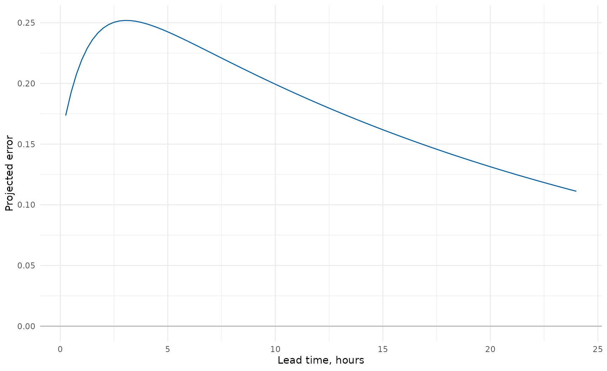
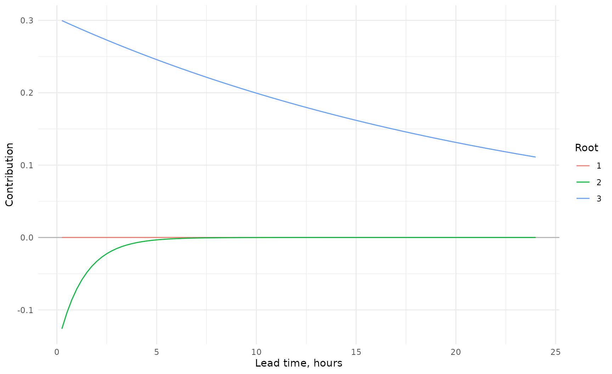
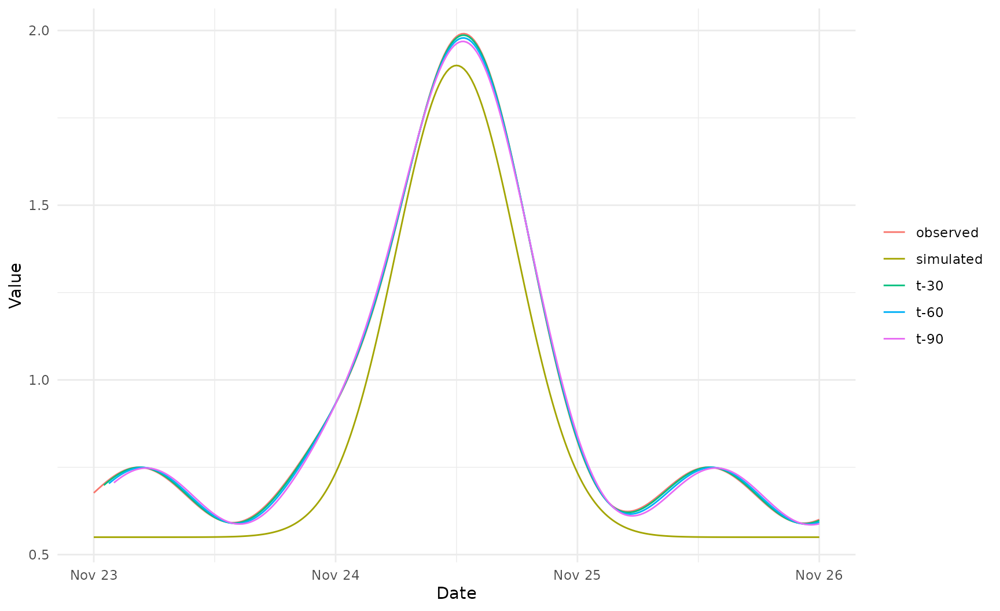
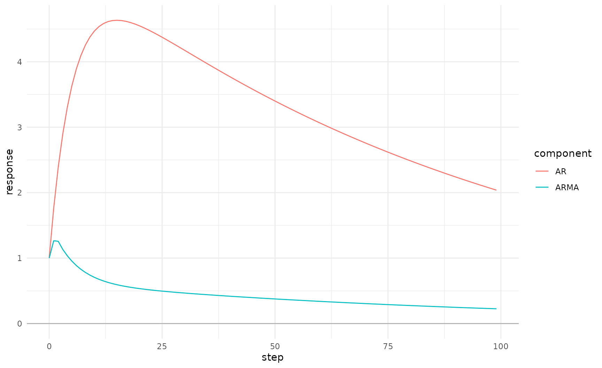

# Using reach.postproc

## Purpose

This vignette provides a complete practical workflow. `reach.io` should
import and standardise source data. `reach.rate` should apply any
required level-flow conversion. `reach.postproc` starts from prepared
series in the same domain and units.

## Choose a workflow

## Construct parameters

``` r

parameters <- default_ar_parameters()
parameters@coefficients
#>       a_1       a_2       a_3 
#>  1.765000 -0.726250 -0.040656
```

Explicit Deltares parameters:

``` r

deltares <- ar_parameters(
  coefficients = c(
    a_1 = 1.765,
    a_2 = -0.72625,
    a_3 = -0.040656
  ),
  sign_convention = "Deltares",
  label = "2024 defaults"
)
```

Equivalent standard signed-equation parameters:

``` r

standard <- ar_parameters(
  coefficients = c(
    phi_1 = -1.765,
    phi_2 = 0.72625,
    phi_3 = 0.040656
  ),
  sign_convention = "Standard"
)

all.equal(deltares@coefficients, standard@coefficients)
#> [1] TRUE
```

## Inspect and assess roots

``` r

root_information <- roots(parameters, time_step_minutes = 15)
root_table(root_information)
#>    root_id   root_real root_imaginary root_modulus lag_root_real
#>      <int>       <num>          <num>        <num>         <num>
#> 1:       3  0.98961490   1.100114e-24   0.98961490      1.010494
#> 2:       2  0.82517187  -1.306909e-24   0.82517187      1.211869
#> 3:       1 -0.04978678   2.067952e-25   0.04978678    -20.085655
#>    lag_root_imaginary lag_root_modulus raw_decay_time_steps decay_time_steps
#>                 <num>            <num>                <num>            <num>
#> 1:      -1.123324e-24         1.010494           95.7909755       95.7909755
#> 2:       1.919360e-24         1.211869            5.2038996        5.2038996
#> 3:      -8.342810e-23        20.085655            0.3333327        0.3333327
#>    effective_decay_time_steps decay_time_hours effective_decay_time_hours
#>                         <num>            <num>                      <num>
#> 1:                 95.7909755      23.94774387                 23.9477439
#> 2:                  5.2038996       1.30097489                  1.3009749
#> 3:                  0.2338708       0.08333317                  0.0584677
#>    oscillation_period_steps oscillation_period_hours is_growing is_persistent
#>                       <num>                    <num>     <lgcl>        <lgcl>
#> 1:                      Inf                      Inf      FALSE         FALSE
#> 2:                      Inf                      Inf      FALSE         FALSE
#> 3:                        2                      0.5      FALSE         FALSE
#>    is_oscillating modal_stability lag_stability display_order
#>            <lgcl>          <fctr>        <fctr>         <int>
#> 1:          FALSE          Stable        Stable             1
#> 2:          FALSE          Stable        Stable             2
#> 3:           TRUE          Stable        Stable             3
plot_ar(root_information, root_definition = "modal")
```


``` r

assessment <- assess(parameters)
assessment@summary
#> [1] "Pass. All roots meet the accepted criteria."
assessment_table(assessment)
#>    test_id                        test failed affected_roots
#>     <char>                      <char> <lgcl>         <list>
#> 1:   order          Permitted AR order  FALSE               
#> 2:       a          Exponential growth  FALSE               
#> 3:       b        Excessive decay time  FALSE               
#> 4:       c All roots decay too quickly  FALSE               
#> 5:       d    Unacceptable oscillation  FALSE               
#>               criterion
#>                  <char>
#> 1:      permitted order
#> 2:      no growing root
#> 3:        maximum decay
#> 4: minimum useful decay
#> 5:    oscillation ratio
```

Do not continue to operational evaluation with parameters that fail,
unless the departure from the default criteria is documented and
justified for the site.

## Forecast one error series

Initial errors are newest first.

``` r

error_forecast <- forecast_ar(
  parameters,
  initial_errors = c(0.15, 0.12, 0.10),
  steps = 96L,
  time_step_minutes = 15
)

forecast_series(error_forecast)
#>      step lead_time_minutes lead_time_hours  ar_error
#>     <int>             <num>           <num>     <num>
#>  1:     1                15            0.25 0.1735344
#>  2:     2                30            0.50 0.1924720
#>  3:     3                45            0.75 0.2075853
#>  4:     4                60            1.00 0.2195501
#>  5:     5                75            1.25 0.2289219
#>  6:     6                90            1.50 0.2361593
#>  7:     7               105            1.75 0.2416407
#>  8:     8               120            2.00 0.2456780
#>  9:     9               135            2.25 0.2485289
#> 10:    10               150            2.50 0.2504056
#> 11:    11               165            2.75 0.2514836
#> 12:    12               180            3.00 0.2519072
#> 13:    13               195            3.25 0.2517958
#> 14:    14               210            3.50 0.2512477
#> 15:    15               225            3.75 0.2503439
#> 16:    16               240            4.00 0.2491514
#> 17:    17               255            4.25 0.2477252
#> 18:    18               270            4.50 0.2461108
#> 19:    19               285            4.75 0.2443456
#> 20:    20               300            5.00 0.2424605
#> 21:    21               315            5.25 0.2404809
#> 22:    22               330            5.50 0.2384278
#> 23:    23               345            5.75 0.2363183
#> 24:    24               360            6.00 0.2341666
#> 25:    25               375            6.25 0.2319844
#> 26:    26               390            6.50 0.2297812
#> 27:    27               405            6.75 0.2275649
#> 28:    28               420            7.00 0.2253418
#> 29:    29               435            7.25 0.2231174
#> 30:    30               450            7.50 0.2208958
#> 31:    31               465            7.75 0.2186806
#> 32:    32               480            8.00 0.2164746
#> 33:    33               495            8.25 0.2142801
#> 34:    34               510            8.50 0.2120991
#> 35:    35               525            8.75 0.2099330
#> 36:    36               540            9.00 0.2077829
#> 37:    37               555            9.25 0.2056500
#> 38:    38               570            9.50 0.2035348
#> 39:    39               585            9.75 0.2014380
#> 40:    40               600           10.00 0.1993600
#> 41:    41               615           10.25 0.1973012
#> 42:    42               630           10.50 0.1952617
#> 43:    43               645           10.75 0.1932418
#> 44:    44               660           11.00 0.1912414
#> 45:    45               675           11.25 0.1892607
#> 46:    46               690           11.50 0.1872996
#> 47:    47               705           11.75 0.1853581
#> 48:    48               720           12.00 0.1834362
#> 49:    49               735           12.25 0.1815337
#> 50:    50               750           12.50 0.1796505
#> 51:    51               765           12.75 0.1777865
#> 52:    52               780           13.00 0.1759415
#> 53:    53               795           13.25 0.1741155
#> 54:    54               810           13.50 0.1723082
#> 55:    55               825           13.75 0.1705196
#> 56:    56               840           14.00 0.1687494
#> 57:    57               855           14.25 0.1669974
#> 58:    58               870           14.50 0.1652636
#> 59:    59               885           14.75 0.1635477
#> 60:    60               900           15.00 0.1618495
#> 61:    61               915           15.25 0.1601689
#> 62:    62               930           15.50 0.1585058
#> 63:    63               945           15.75 0.1568598
#> 64:    64               960           16.00 0.1552310
#> 65:    65               975           16.25 0.1536190
#> 66:    66               990           16.50 0.1520237
#> 67:    67              1005           16.75 0.1504450
#> 68:    68              1020           17.00 0.1488827
#> 69:    69              1035           17.25 0.1473366
#> 70:    70              1050           17.50 0.1458066
#> 71:    71              1065           17.75 0.1442924
#> 72:    72              1080           18.00 0.1427939
#> 73:    73              1095           18.25 0.1413110
#> 74:    74              1110           18.50 0.1398435
#> 75:    75              1125           18.75 0.1383912
#> 76:    76              1140           19.00 0.1369540
#> 77:    77              1155           19.25 0.1355318
#> 78:    78              1170           19.50 0.1341243
#> 79:    79              1185           19.75 0.1327314
#> 80:    80              1200           20.00 0.1313530
#> 81:    81              1215           20.25 0.1299889
#> 82:    82              1230           20.50 0.1286389
#> 83:    83              1245           20.75 0.1273030
#> 84:    84              1260           21.00 0.1259809
#> 85:    85              1275           21.25 0.1246726
#> 86:    86              1290           21.50 0.1233779
#> 87:    87              1305           21.75 0.1220966
#> 88:    88              1320           22.00 0.1208286
#> 89:    89              1335           22.25 0.1195738
#> 90:    90              1350           22.50 0.1183320
#> 91:    91              1365           22.75 0.1171031
#> 92:    92              1380           23.00 0.1158870
#> 93:    93              1395           23.25 0.1146835
#> 94:    94              1410           23.50 0.1134925
#> 95:    95              1425           23.75 0.1123139
#> 96:    96              1440           24.00 0.1111475
#>      step lead_time_minutes lead_time_hours  ar_error
#>     <int>             <num>           <num>     <num>
plot_ar(error_forecast)
```



Apply the errors to a simulated series:

``` r

simulated <- 0.8 + 1.2 * exp(
  -((forecast_series(error_forecast)$lead_time_hours - 12) / 4)^2
)

updated <- apply_ar_update(
  simulated = simulated,
  ar_error = forecast_series(error_forecast)$ar_error,
  lower_limit = 0,
  time = forecast_series(error_forecast)$lead_time_hours
)

updated
#>      time simulated  ar_error updated_unconstrained   updated was_limited
#>     <num>     <num>     <num>                 <num>     <num>      <lgcl>
#>  1:  0.25 0.8002146 0.1735344             0.9737490 0.9737490       FALSE
#>  2:  0.50 0.8003086 0.1924720             0.9927806 0.9927806       FALSE
#>  3:  0.75 0.8004404 0.2075853             1.0080257 1.0080257       FALSE
#>  4:  1.00 0.8006235 0.2195501             1.0201736 1.0201736       FALSE
#>  5:  1.25 0.8008758 0.2289219             1.0297977 1.0297977       FALSE
#>  6:  1.50 0.8012207 0.2361593             1.0373801 1.0373801       FALSE
#>  7:  1.75 0.8016882 0.2416407             1.0433289 1.0433289       FALSE
#>  8:  2.00 0.8023165 0.2456780             1.0479946 1.0479946       FALSE
#>  9:  2.25 0.8031540 0.2485289             1.0516829 1.0516829       FALSE
#> 10:  2.50 0.8042608 0.2504056             1.0546664 1.0546664       FALSE
#> 11:  2.75 0.8057112 0.2514836             1.0571947 1.0571947       FALSE
#> 12:  3.00 0.8075957 0.2519072             1.0595029 1.0595029       FALSE
#> 13:  3.25 0.8100234 0.2517958             1.0618192 1.0618192       FALSE
#> 14:  3.50 0.8131241 0.2512477             1.0643718 1.0643718       FALSE
#> 15:  3.75 0.8170503 0.2503439             1.0673943 1.0673943       FALSE
#> 16:  4.00 0.8219788 0.2491514             1.0711301 1.0711301       FALSE
#> 17:  4.25 0.8281113 0.2477252             1.0758364 1.0758364       FALSE
#> 18:  4.50 0.8356751 0.2461108             1.0817858 1.0817858       FALSE
#> 19:  4.75 0.8449217 0.2443456             1.0892673 1.0892673       FALSE
#> 20:  5.00 0.8561247 0.2424605             1.0985853 1.0985853       FALSE
#> 21:  5.25 0.8695761 0.2404809             1.1100570 1.1100570       FALSE
#> 22:  5.50 0.8855800 0.2384278             1.1240078 1.1240078       FALSE
#> 23:  5.75 0.9044460 0.2363183             1.1407643 1.1407643       FALSE
#> 24:  6.00 0.9264791 0.2341666             1.1606457 1.1606457       FALSE
#> 25:  6.25 0.9519681 0.2319844             1.1839525 1.1839525       FALSE
#> 26:  6.50 0.9811729 0.2297812             1.2109541 1.2109541       FALSE
#> 27:  6.75 1.0143094 0.2275649             1.2418742 1.2418742       FALSE
#> 28:  7.00 1.0515337 0.2253418             1.2768755 1.2768755       FALSE
#> 29:  7.25 1.0929262 0.2231174             1.3160436 1.3160436       FALSE
#> 30:  7.50 1.1384755 0.2208958             1.3593713 1.3593713       FALSE
#> 31:  7.75 1.1880641 0.2186806             1.4067447 1.4067447       FALSE
#> 32:  8.00 1.2414553 0.2164746             1.4579299 1.4579299       FALSE
#> 33:  8.25 1.2982842 0.2142801             1.5125643 1.5125643       FALSE
#> 34:  8.50 1.3580518 0.2120991             1.5701509 1.5701509       FALSE
#> 35:  8.75 1.4201247 0.2099330             1.6300577 1.6300577       FALSE
#> 36:  9.00 1.4837394 0.2077829             1.6915223 1.6915223       FALSE
#> 37:  9.25 1.5480132 0.2056500             1.7536631 1.7536631       FALSE
#> 38:  9.50 1.6119606 0.2035348             1.8154954 1.8154954       FALSE
#> 39:  9.75 1.6745160 0.2014380             1.8759540 1.8759540       FALSE
#> 40: 10.00 1.7345609 0.1993600             1.9339210 1.9339210       FALSE
#> 41: 10.25 1.7909564 0.1973012             1.9882576 1.9882576       FALSE
#> 42: 10.50 1.8425781 0.1952617             2.0378398 2.0378398       FALSE
#> 43: 10.75 1.8883527 0.1932418             2.0815945 2.0815945       FALSE
#> 44: 11.00 1.9272957 0.1912414             2.1185371 2.1185371       FALSE
#> 45: 11.25 1.9585455 0.1892607             2.1478062 2.1478062       FALSE
#> 46: 11.50 1.9813957 0.1872996             2.1686953 2.1686953       FALSE
#> 47: 11.75 1.9953216 0.1853581             2.1806798 2.1806798       FALSE
#> 48: 12.00 2.0000000 0.1834362             2.1834362 2.1834362       FALSE
#> 49: 12.25 1.9953216 0.1815337             2.1768553 2.1768553       FALSE
#> 50: 12.50 1.9813957 0.1796505             2.1610462 2.1610462       FALSE
#> 51: 12.75 1.9585455 0.1777865             2.1363319 2.1363319       FALSE
#> 52: 13.00 1.9272957 0.1759415             2.1032372 2.1032372       FALSE
#> 53: 13.25 1.8883527 0.1741155             2.0624682 2.0624682       FALSE
#> 54: 13.50 1.8425781 0.1723082             2.0148863 2.0148863       FALSE
#> 55: 13.75 1.7909564 0.1705196             1.9614760 1.9614760       FALSE
#> 56: 14.00 1.7345609 0.1687494             1.9033103 1.9033103       FALSE
#> 57: 14.25 1.6745160 0.1669974             1.8415134 1.8415134       FALSE
#> 58: 14.50 1.6119606 0.1652636             1.7772242 1.7772242       FALSE
#> 59: 14.75 1.5480132 0.1635477             1.7115608 1.7115608       FALSE
#> 60: 15.00 1.4837394 0.1618495             1.6455889 1.6455889       FALSE
#> 61: 15.25 1.4201247 0.1601689             1.5802936 1.5802936       FALSE
#> 62: 15.50 1.3580518 0.1585058             1.5165576 1.5165576       FALSE
#> 63: 15.75 1.2982842 0.1568598             1.4551440 1.4551440       FALSE
#> 64: 16.00 1.2414553 0.1552310             1.3966863 1.3966863       FALSE
#> 65: 16.25 1.1880641 0.1536190             1.3416831 1.3416831       FALSE
#> 66: 16.50 1.1384755 0.1520237             1.2904993 1.2904993       FALSE
#> 67: 16.75 1.0929262 0.1504450             1.2433712 1.2433712       FALSE
#> 68: 17.00 1.0515337 0.1488827             1.2004164 1.2004164       FALSE
#> 69: 17.25 1.0143094 0.1473366             1.1616460 1.1616460       FALSE
#> 70: 17.50 0.9811729 0.1458066             1.1269795 1.1269795       FALSE
#> 71: 17.75 0.9519681 0.1442924             1.0962605 1.0962605       FALSE
#> 72: 18.00 0.9264791 0.1427939             1.0692730 1.0692730       FALSE
#> 73: 18.25 0.9044460 0.1413110             1.0457571 1.0457571       FALSE
#> 74: 18.50 0.8855800 0.1398435             1.0254235 1.0254235       FALSE
#> 75: 18.75 0.8695761 0.1383912             1.0079673 1.0079673       FALSE
#> 76: 19.00 0.8561247 0.1369540             0.9930788 0.9930788       FALSE
#> 77: 19.25 0.8449217 0.1355318             0.9804535 0.9804535       FALSE
#> 78: 19.50 0.8356751 0.1341243             0.9697993 0.9697993       FALSE
#> 79: 19.75 0.8281113 0.1327314             0.9608427 0.9608427       FALSE
#> 80: 20.00 0.8219788 0.1313530             0.9533317 0.9533317       FALSE
#> 81: 20.25 0.8170503 0.1299889             0.9470392 0.9470392       FALSE
#> 82: 20.50 0.8131241 0.1286389             0.9417630 0.9417630       FALSE
#> 83: 20.75 0.8100234 0.1273030             0.9373264 0.9373264       FALSE
#> 84: 21.00 0.8075957 0.1259809             0.9335766 0.9335766       FALSE
#> 85: 21.25 0.8057112 0.1246726             0.9303838 0.9303838       FALSE
#> 86: 21.50 0.8042608 0.1233779             0.9276387 0.9276387       FALSE
#> 87: 21.75 0.8031540 0.1220966             0.9252506 0.9252506       FALSE
#> 88: 22.00 0.8023165 0.1208286             0.9231452 0.9231452       FALSE
#> 89: 22.25 0.8016882 0.1195738             0.9212620 0.9212620       FALSE
#> 90: 22.50 0.8012207 0.1183320             0.9195527 0.9195527       FALSE
#> 91: 22.75 0.8008758 0.1171031             0.9179790 0.9179790       FALSE
#> 92: 23.00 0.8006235 0.1158870             0.9165105 0.9165105       FALSE
#> 93: 23.25 0.8004404 0.1146835             0.9151239 0.9151239       FALSE
#> 94: 23.50 0.8003086 0.1134925             0.9138011 0.9138011       FALSE
#> 95: 23.75 0.8002146 0.1123139             0.9125285 0.9125285       FALSE
#> 96: 24.00 0.8001481 0.1111475             0.9112956 0.9112956       FALSE
#>      time simulated  ar_error updated_unconstrained   updated was_limited
#>     <num>     <num>     <num>                 <num>     <num>      <lgcl>
```

## Inspect root contributions

``` r

components <- decompose_ar(
  parameters,
  initial_errors = c(0.15, 0.12, 0.10),
  steps = 96L,
  time_step_minutes = 15
)

ggplot(components, aes(lead_time_hours, contribution_real,
                       colour = factor(root_number))) +
  geom_hline(yintercept = 0, colour = "grey70") +
  geom_line() +
  theme_minimal() +
  labs(colour = "Root", x = "Lead time, hours", y = "Contribution")
```



## Prepare reproducible event data

``` r

event_time <- seq(
  as.POSIXct("2024-11-23 00:00:00", tz = "UTC"),
  by = "15 min",
  length.out = 289L
)

simulated_values <- 0.55 + 1.35 * exp(
  -((seq_along(event_time) - 145) / 34)^2
)

observed_values <- simulated_values +
  0.12 +
  0.08 * sin(seq_along(event_time) / 12)

observed <- data.table(
  date_time = event_time,
  value = observed_values
)

simulated <- data.table(
  date_time = event_time,
  value = simulated_values
)
```

## Align the event

``` r

aligned <- align_forecast_series(
  observed = observed,
  simulated = simulated,
  interval_minutes = 15,
  timezone = "UTC",
  metadata = list(
    site_id = "example-site",
    event_id = "synthetic-event",
    measure = "level",
    units = "m"
  )
)

alignment_diagnostics(aligned)
#>    observed_rows simulated_rows aligned_rows missing_observed missing_simulated
#>            <int>          <int>        <int>            <int>             <int>
#> 1:           289            289          289                0                 0
#>    regular_time_step
#>               <lgcl>
#> 1:              TRUE
aligned_series(aligned)
#> Key: <date_time>
#>                date_time  observed simulated      error
#>                   <POSc>     <num>     <num>      <num>
#>   1: 2024-11-23 00:00:00 0.6766590 0.5500000 0.12665895
#>   2: 2024-11-23 00:15:00 0.6832717 0.5500000 0.13327169
#>   3: 2024-11-23 00:30:00 0.6897924 0.5500000 0.13979232
#>   4: 2024-11-23 00:45:00 0.6961756 0.5500000 0.14617558
#>   5: 2024-11-23 01:00:00 0.7023772 0.5500001 0.15237717
#>  ---                                                   
#> 285: 2024-11-25 23:00:00 0.5914105 0.5500001 0.04141042
#> 286: 2024-11-25 23:15:00 0.5929281 0.5500000 0.04292803
#> 287: 2024-11-25 23:30:00 0.5949806 0.5500000 0.04498055
#> 288: 2024-11-25 23:45:00 0.5975538 0.5500000 0.04755373
#> 289: 2024-11-26 00:00:00 0.6006297 0.5500000 0.05062972
```

Stop if diagnostics show unexpected duplicates, gaps or irregular
timesteps.

## Calculate fixed lead-time updates

``` r

lead_results <- fixed_lead_ar(
  parameters = parameters,
  data = aligned,
  lead_times_minutes = c(30, 60, 90),
  time_step_minutes = 15,
  lower_limit = 0,
  method = "recurrence",
  metadata = list(
    site_id = "example-site",
    event_id = "synthetic-event"
  )
)

lead_time_series(lead_results)
#>                date_time lead_time_minutes  observed simulated   ar_error
#>                   <POSc>             <num>     <num>     <num>      <num>
#>   1: 2024-11-23 00:00:00                30 0.6766590 0.5500000         NA
#>   2: 2024-11-23 00:15:00                30 0.6832717 0.5500000         NA
#>   3: 2024-11-23 00:30:00                30 0.6897924 0.5500000         NA
#>   4: 2024-11-23 00:45:00                30 0.6961756 0.5500000         NA
#>   5: 2024-11-23 01:00:00                30 0.7023772 0.5500001 0.14862147
#>  ---                                                                     
#> 863: 2024-11-25 23:00:00                90 0.5914105 0.5500001 0.03546211
#> 864: 2024-11-25 23:15:00                90 0.5929281 0.5500000 0.03535012
#> 865: 2024-11-25 23:30:00                90 0.5949806 0.5500000 0.03580188
#> 866: 2024-11-25 23:45:00                90 0.5975538 0.5500000 0.03681422
#> 867: 2024-11-26 00:00:00                90 0.6006297 0.5500000 0.03838014
#>      updated_unconstrained   updated calculation_method
#>                      <num>     <num>             <char>
#>   1:                    NA        NA         recurrence
#>   2:                    NA        NA         recurrence
#>   3:                    NA        NA         recurrence
#>   4:                    NA        NA         recurrence
#>   5:             0.6986215 0.6986215         recurrence
#>  ---                                                   
#> 863:             0.5854622 0.5854622         recurrence
#> 864:             0.5853502 0.5853502         recurrence
#> 865:             0.5858019 0.5858019         recurrence
#> 866:             0.5868142 0.5868142         recurrence
#> 867:             0.5883802 0.5883802         recurrence
```

## Score performance

``` r

scores <- score_lead_times(lead_results)
scores
#>    lead_time_minutes     n mae_simulated mae_updated rmse_simulated
#>                <num> <int>         <num>       <num>          <num>
#> 1:                30   285     0.1213368 0.002291136      0.1342672
#> 2:                60   283     0.1210963 0.006631047      0.1341061
#> 3:                90   281     0.1207712 0.012255708      0.1338448
#>    rmse_updated bias_simulated  bias_updated improvement_mae improvement_rmse
#>           <num>          <num>         <num>           <num>            <num>
#> 1:  0.002588442     -0.1213368 -0.0004370453       0.1190456        0.1316788
#> 2:  0.007497978     -0.1210963 -0.0012167184       0.1144652        0.1266081
#> 3:  0.013871801     -0.1207712 -0.0021711797       0.1085155        0.1199730
```

Positive MAE or RMSE improvement means the updated series outperformed
the simulation. Bias must be interpreted by distance from zero as well
as sign.

## Plot results

``` r

plot_lead_times(lead_results)
```



## Verify numerical equivalence

During package development, root projection should agree with recurrence
projection within numerical tolerance.

``` r

recurrence_results <- fixed_lead_ar(
  parameters,
  aligned,
  lead_times_minutes = c(30, 60, 90),
  method = "recurrence"
)

root_results <- fixed_lead_ar(
  parameters,
  aligned,
  lead_times_minutes = c(30, 60, 90),
  method = "roots"
)
```

## ARMA response analysis

``` r

response_data <- response_components(
  parameters,
  ma_parameters = c(-0.5, -0.25, -0.125),
  steps = 100L
)

ggplot(response_data, aes(step, response, colour = component)) +
  geom_hline(yintercept = 0, colour = "grey70") +
  geom_line() +
  theme_minimal()
```



## Export outputs

Calculation functions do not write files. Save only where the calling
workflow requests it.

``` r

fwrite(
  lead_time_series(lead_results),
  "lead-time-series.csv"
)

fwrite(
  scores,
  "lead-time-scores.csv"
)

ggsave(
  "lead-time-plot.png",
  plot = plot_lead_times(lead_results),
  width = 300,
  height = 150,
  units = "mm",
  dpi = 300,
  bg = "white"
)
```

## Recommended sequence

1.  Import with `reach.io`.
2.  Convert with `reach.rate` if required.
3.  Confirm common domain and units.
4.  Align timestamps and inspect diagnostics.
5.  Construct parameters with the correct sign convention.
6.  Inspect roots and assess quality.
7.  Calculate fixed lead-time updates.
8.  Score and plot performance.
9.  Compare methods during validation.
10. Export only required outputs.
