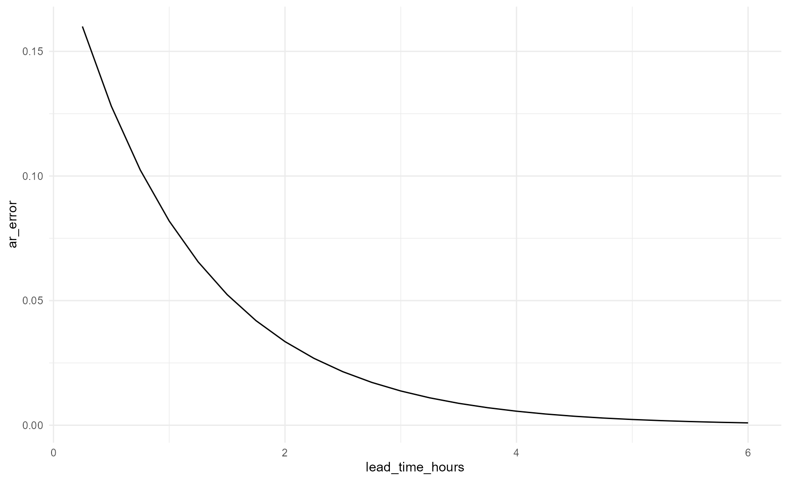
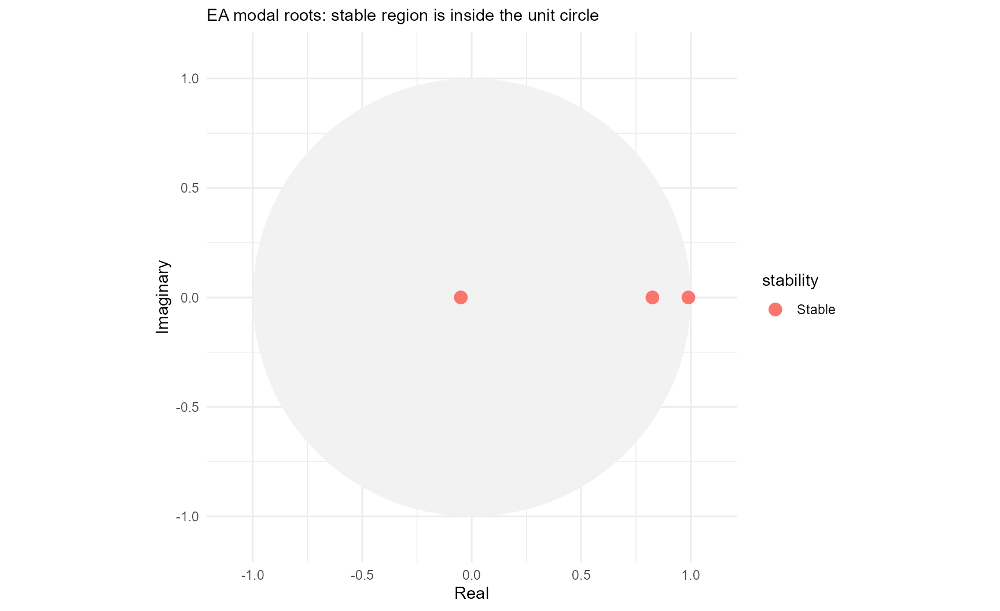

# ARMA for Novice Flood Forecast Modellers

## Purpose

This vignette explains AR and ARMA without assuming a background in
time-series mathematics. It is written for flood forecast modellers who
need to understand what an update is doing, judge whether its behaviour
makes sense and know when to investigate the data rather than the
parameters.

The current Environment Agency implementation in IMFS uses the
autoregressive part of ARMA. People still often call the process ARMA
because that is the name of the wider method and the underlying
Delft-FEWS module.

## What ARMA does

A hydrological or hydraulic model produces a simulated river level or
flow. The simulation will rarely match the latest observation exactly.
AR uses the recent difference between those two series to estimate how
the difference may develop after the forecast starts.

AR does not replace the forecasting model. It updates the model output.

## The sign of the error

`reach.postproc` uses:

``` math

\text{error}=\text{observation}-\text{simulation}.
```

Suppose the observation is 1.20 m and the simulation is 1.00 m:

``` text
error = 1.20 - 1.00 = +0.20 m
```

A positive error means the simulation is too low. A negative error means
the simulation is too high.

``` r
calculate_model_error(
  observed = c(1.20, 0.95),
  simulated = c(1.00, 1.10)
)
#> [1]  0.20 -0.15
```

The updated forecast is the simulation plus the projected error. A
positive projected error raises the forecast. A negative projected error
lowers it.

## A simple AR model

The simplest AR model remembers one previous error. If its coefficient
is 0.8, each new projected error retains 80% of the previous value.

Starting from 0.20 m:

``` text
Forecast start   0.200 m
15 minutes       0.160 m
30 minutes       0.128 m
45 minutes       0.102 m
```

The error fades because the coefficient is smaller than one.

``` r
simple_parameters <- ar_parameters(
  coefficients = c(a_1 = 0.8),
  label = "Simple AR(1) example"
)

simple_forecast <- forecast_ar(
  simple_parameters,
  initial_errors = 0.20,
  steps = 24L,
  time_step_minutes = 15
)

forecast_series(simple_forecast)
#>      step lead_time_minutes lead_time_hours     ar_error
#>     <int>             <num>           <num>        <num>
#>  1:     1                15            0.25 0.1600000000
#>  2:     2                30            0.50 0.1280000000
#>  3:     3                45            0.75 0.1024000000
#>  4:     4                60            1.00 0.0819200000
#>  5:     5                75            1.25 0.0655360000
#>  6:     6                90            1.50 0.0524288000
#>  7:     7               105            1.75 0.0419430400
#>  8:     8               120            2.00 0.0335544320
#>  9:     9               135            2.25 0.0268435456
#> 10:    10               150            2.50 0.0214748365
#> 11:    11               165            2.75 0.0171798692
#> 12:    12               180            3.00 0.0137438953
#> 13:    13               195            3.25 0.0109951163
#> 14:    14               210            3.50 0.0087960930
#> 15:    15               225            3.75 0.0070368744
#> 16:    16               240            4.00 0.0056294995
#> 17:    17               255            4.25 0.0045035996
#> 18:    18               270            4.50 0.0036028797
#> 19:    19               285            4.75 0.0028823038
#> 20:    20               300            5.00 0.0023058430
#> 21:    21               315            5.25 0.0018446744
#> 22:    22               330            5.50 0.0014757395
#> 23:    23               345            5.75 0.0011805916
#> 24:    24               360            6.00 0.0009444733
#>      step lead_time_minutes lead_time_hours     ar_error
#>     <int>             <num>           <num>        <num>
plot_ar(simple_forecast)
```



If the coefficient exceeded one, the error would grow. If it were
negative, the projected error would change sign every timestep.

## Why use two or three recent errors?

One value tells us the current mismatch. Several values indicate whether
the mismatch is steady, increasing, decreasing or changing sign.

A third-order model uses three recent errors. It can represent richer
short-term behaviour than AR(1), but the raw coefficients are much
harder to interpret.

## Coefficients and roots

The coefficients tell the computer how to calculate one step.
Characteristic roots tell a modeller how the result behaves through
time.

Think of each root as one pattern within the error forecast. A
third-order model has three roots. Their contributions are added
together.

A root tells us whether a contribution:

- fades;
- remains constant;
- grows;
- changes sign;
- oscillates.

``` r
parameters <- default_ar_parameters()
root_information <- roots(parameters)

root_table(root_information)
#>    root_id   root_real root_imaginary root_modulus lag_root_real
#>      <int>       <num>          <num>        <num>         <num>
#> 1:       3  0.98961490   1.100114e-24   0.98961490      1.010494
#> 2:       2  0.82517187  -1.306909e-24   0.82517187      1.211869
#> 3:       1 -0.04978678   2.067952e-25   0.04978678    -20.085655
#>    lag_root_imaginary lag_root_modulus raw_decay_time_steps decay_time_steps
#>                 <num>            <num>                <num>            <num>
#> 1:      -1.123324e-24         1.010494           95.7909755       95.7909755
#> 2:       1.919360e-24         1.211869            5.2038996        5.2038996
#> 3:      -8.342810e-23        20.085655            0.3333327        0.3333327
#>    effective_decay_time_steps decay_time_hours effective_decay_time_hours
#>                         <num>            <num>                      <num>
#> 1:                 95.7909755      23.94774387                 23.9477439
#> 2:                  5.2038996       1.30097489                  1.3009749
#> 3:                  0.2338708       0.08333317                  0.0584677
#>    oscillation_period_steps oscillation_period_hours is_growing is_persistent
#>                       <num>                    <num>     <lgcl>        <lgcl>
#> 1:                      Inf                      Inf      FALSE         FALSE
#> 2:                      Inf                      Inf      FALSE         FALSE
#> 3:                        2                      0.5      FALSE         FALSE
#>    is_oscillating modal_stability lag_stability display_order
#>            <lgcl>          <fctr>        <fctr>         <int>
#> 1:          FALSE          Stable        Stable             1
#> 2:          FALSE          Stable        Stable             2
#> 3:           TRUE          Stable        Stable             3
plot_ar(root_information, root_definition = "modal")
```



## Why are stable roots inside the circle?

The package follows the modal-root convention used in the Environment
Agency guidance.

- Inside the unit circle means the contribution fades.
- On the circle means it persists.
- Outside the circle means it grows.

Some statistics books plot reciprocal lag roots. Their stable region is
outside the circle. The two plots describe the same model from opposite
root conventions.

## Decay time

Decay time describes how long a root remains important. After one decay
time, a non-oscillating contribution has fallen to about 37% of its
starting size.

A root can decay too quickly to add useful information. It can also
remain influential for too long. The suitable timescale depends partly
on catchment response, but the 2024 assessment criteria provide broad
operational limits.

## Oscillation

Oscillation means a contribution moves between positive and negative
values. A negative real root has a period of two timesteps because it
changes sign at every step.

Oscillation is normally undesirable when it remains visible. A very
rapid oscillation can be acceptable if it also disappears almost
immediately. The 2024 defaults contain one such root because it helps
the model accommodate sharp changes in the recent error sequence.

## Parameter assessment

A model passes only when it avoids the main forms of unacceptable
mathematical behaviour.

``` r
assessment <- assess(parameters)
assessment@summary
#> [1] "Pass. All roots meet the accepted criteria."
assessment_table(assessment)
#>    test_id                        test failed affected_roots
#>     <char>                      <char> <lgcl>         <list>
#> 1:   order          Permitted AR order  FALSE               
#> 2:       a          Exponential growth  FALSE               
#> 3:       b        Excessive decay time  FALSE               
#> 4:       c All roots decay too quickly  FALSE               
#> 5:       d    Unacceptable oscillation  FALSE               
#>               criterion
#>                  <char>
#> 1:      permitted order
#> 2:      no growing root
#> 3:        maximum decay
#> 4: minimum useful decay
#> 5:    oscillation ratio
```

A pass does not prove that every update improves the forecast. It means
the parameter set avoids the principal mathematical failure modes.

## Why a passing model can still behave poorly

The roots are fixed by the parameters, but their weights depend on the
recent errors. A steady error history usually gives a smooth projection.
A sharp jump, noisy observation or crossing between observed and
simulated series can produce a much stronger response.

Assess parameters across several events and several forecast start
times.

## Timing errors

AR cannot reliably correct a future timing error. It can react only
after a timing difference appears in the recent observations. The
updated peak may move slightly because a changing correction is added to
the simulation, but this is not a dependable timing correction.

## Zero cut-off

A sufficiently negative projected error can make the unconstrained
update negative. IMFS may replace the displayed value with zero.

The cut-off changes the displayed update. It does not change the
underlying AR recurrence.

## Data gaps

The model needs a complete recent error sequence. Gaps can originate in
telemetry, model output, timestamp alignment or an incomplete rating
curve.

Do not change AR parameters until the input series have been checked.

## Ratings

A rating converts level to flow or flow to level. Ratings are normally
nonlinear. An additive update in flow does not retain exactly the same
shape after conversion to level.

When an update looks odd, inspect both domains where possible and
confirm which domain the AR model actually updates.

## Downstream models

An updated upstream series may be a boundary for a downstream hydraulic
model. Growth, oscillation, cut-off behaviour and rating artefacts can
therefore be transmitted through a model network.

## Fixed lead-time evaluation

A fixed lead-time series asks what the update would have said at every
target time if it had always started the same number of minutes earlier.

This allows fair comparison at 30, 60 or 90 minutes ahead.

## Complete novice workflow

## Glossary

### AR

Autoregressive. Predicts the next error from previous errors.

### AR coefficient

A weight applied to a previous error.

### AR order

The number of previous errors used. AR(3) uses three.

### ARMA

Autoregressive moving average. Combines AR memory with residual
innovation terms.

### Assessment

Checks whether a parameter set avoids unacceptable growth, decay and
oscillation.

### Bias

The average signed forecast error. Positive and negative errors can
cancel.

### Characteristic polynomial

The equation formed from the AR coefficients whose solutions are the
roots.

### Characteristic root

A number describing one exponential or oscillating contribution to the
AR series.

### Complex root

A root with real and imaginary components. Complex roots produce
oscillation.

### Conjugate pair

Two complex roots with matching real components and opposite imaginary
components.

### Cut-off

A lower bound applied to the displayed updated forecast, commonly zero.

### Decay time

A measure of how long a root contribution remains important.

### Deltares convention

The coefficient convention used by IMFS and internally by
`reach.postproc`.

### Effective decay time

A measure of initial decay that includes the extra fall caused by
oscillation.

### Error

Observation minus simulation.

### Error history

The recent sequence used to initialise the AR model.

### Fixed lead time

A constant forecast horizon such as 30, 60 or 90 minutes.

### Forecast origin

The time at which a forecast starts.

### Growing root

A modal root outside the unit circle. Its contribution increases through
time.

### IMFS

Incident Management Forecasting System.

### Innovation

A new residual input in a full ARMA model.

### Lag

A previous timestep.

### MA

Moving average. The part of ARMA describing current and recent
innovations. It is not a rolling average of forecast values.

### MAE

Mean absolute error. Lower values are better.

### Marginal root

A root on the unit circle whose contribution neither grows nor decays.

### Modal root

The root definition used in the EA guidance. Stable modal roots lie
inside the unit circle.

### Modulus

A root’s distance from zero.

### Observation

A measured level or flow.

### Oscillation

Repeated movement between positive and negative values.

### Oscillation period

The number of timesteps in one complete oscillation.

### Parameter set

The full collection of coefficients for one AR model.

### Persistence

The tendency of an error contribution to remain important.

### Projected error

The future error estimated by AR or ARMA.

### Rating

A relationship used to convert between level and flow.

### Reciprocal lag root

The reciprocal of a modal root. Stable reciprocal roots lie outside the
unit circle.

### Recurrence relation

A rule that calculates the next value from previous values.

### Residual

The part of the error not explained by the AR contribution.

### Response function

The time series produced by a unit innovation.

### RMSE

Root mean square error. It gives more weight to large errors than MAE.

### Simulation

The forecast model output before updating.

### Stable root

A root whose contribution fades.

### Threshold

A level or flow used to support warning or operational decisions.

### Timestep

The interval between consecutive values, normally 15 minutes in current
IMFS AR models.

### Unit circle

The stability boundary with radius one in the complex-root plane.

### Updated forecast

The simulation plus the projected error.

## Key messages

1.  AR updates model error, not river response.
2.  Positive error means the simulation is too low.
3.  Assess parameters before use.
4.  Stable modal roots lie inside the unit circle.
5.  A pass does not guarantee improvement every time.
6.  Check gaps, ratings and cut-offs before blaming parameters.
7.  AR does not reliably correct future timing errors.
8.  Judge performance across multiple events and lead times.
